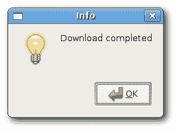
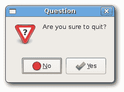
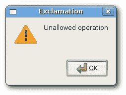
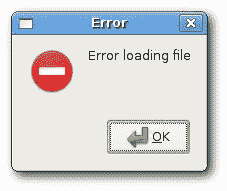
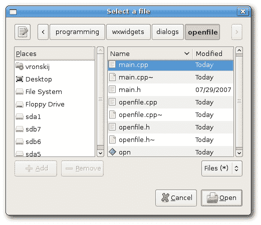
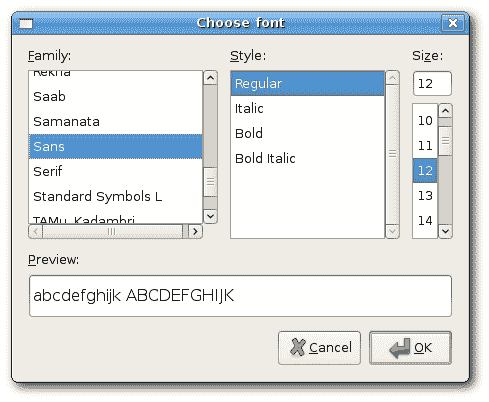
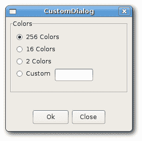

# wxWidgets 中的对话框

> 原文： [http://zetcode.com/gui/wxwidgets/dialogs/](http://zetcode.com/gui/wxwidgets/dialogs/)

对话框窗口或对话框是大多数现代 GUI 应用必不可少的部分。 对话被定义为两个或更多人之间的对话。 在计算机应用中，对话框是一个窗口，用于与应用“对话”。 对话框用于输入数据，修改数据，更改应用设置等。对话框是用户与计算机程序之间进行通信的重要手段。

对话框本质上有两种：预定义对话框和自定义对话框。

## 预定义对话框

预定义对话框是 wxWidgets 工具包中可用的对话框。 这些是用于常见编程任务的对话框，例如显示文本，接收输入，加载和保存文件等。它们可以节省程序员的时间，并通过使用某些标准行为来增强功能。

## 消息对话框

消息对话框用于向用户显示消息。 它们是可定制的。 我们可以更改将在对话框中显示的图标和按钮。

`Messages.h`

```cpp
#include <wx/wx.h>

class Messages : public wxFrame
{
public:
    Messages(const wxString& title);

    void ShowMessage1(wxCommandEvent & event);
    void ShowMessage2(wxCommandEvent & event);
    void ShowMessage3(wxCommandEvent & event);
    void ShowMessage4(wxCommandEvent & event);

};

const int ID_INFO = 1;
const int ID_ERROR = 2;
const int ID_QUESTION = 3;
const int ID_ALERT = 4;

```

`Messages.cpp`

```cpp
#include "Messages.h"

Messages::Messages(const wxString& title)
       : wxFrame(NULL, wxID_ANY, title, wxDefaultPosition, wxSize(210, 110))
{

  wxPanel *panel = new wxPanel(this, wxID_ANY);

  wxBoxSizer *hbox = new wxBoxSizer(wxHORIZONTAL);
  wxGridSizer *gs = new wxGridSizer(2, 2, 2, 2);

  wxButton *btn1 = new wxButton(panel, ID_INFO, wxT("Info"));
  wxButton *btn2 = new wxButton(panel, ID_ERROR, wxT("Error"));
  wxButton *btn3 = new wxButton(panel, ID_QUESTION, wxT("Question"));
  wxButton *btn4 = new wxButton(panel, ID_ALERT, wxT("Alert"));

  Connect(ID_INFO, wxEVT_COMMAND_BUTTON_CLICKED, 
      wxCommandEventHandler(Messages::ShowMessage1));
  Connect(ID_ERROR, wxEVT_COMMAND_BUTTON_CLICKED, 
      wxCommandEventHandler(Messages::ShowMessage2));
  Connect(ID_QUESTION, wxEVT_COMMAND_BUTTON_CLICKED, 
      wxCommandEventHandler(Messages::ShowMessage3));
  Connect(ID_ALERT, wxEVT_COMMAND_BUTTON_CLICKED, 
      wxCommandEventHandler(Messages::ShowMessage4));

  gs->Add(btn1, 1, wxEXPAND);
  gs->Add(btn2, 1);
  gs->Add(btn3, 1);
  gs->Add(btn4, 1);

  hbox->Add(gs, 0, wxALL, 15);
  panel->SetSizer(hbox);

  Center();
}

void Messages::ShowMessage1(wxCommandEvent& event) 
{
  wxMessageDialog *dial = new wxMessageDialog(NULL, 
      wxT("Download completed"), wxT("Info"), wxOK);
  dial->ShowModal();
}

void Messages::ShowMessage2(wxCommandEvent& event) 
{
   wxMessageDialog *dial = new wxMessageDialog(NULL, 
      wxT("Error loading file"), wxT("Error"), wxOK | wxICON_ERROR);
   dial->ShowModal();
}

void Messages::ShowMessage3(wxCommandEvent& event) 
{
  wxMessageDialog *dial = new wxMessageDialog(NULL, 
      wxT("Are you sure to quit?"), wxT("Question"), 
      wxYES_NO | wxNO_DEFAULT | wxICON_QUESTION);
  dial->ShowModal();
}

void Messages::ShowMessage4(wxCommandEvent& event) 
{
  wxMessageDialog *dial = new wxMessageDialog(NULL, 
      wxT("Unallowed operation"), wxT("Exclamation"), 
      wxOK | wxICON_EXCLAMATION);
  dial->ShowModal();
}

```

`main.h`

```cpp
#include <wx/wx.h>

class MyApp : public wxApp
{
  public:
    virtual bool OnInit();
};

```

`main.cpp`

```cpp
#include "main.h"
#include "Messages.h"

IMPLEMENT_APP(MyApp)

bool MyApp::OnInit()
{

  Messages *msgs = new Messages(wxT("Messages"));
  msgs->Show(true);

  return true;
}

```

在我们的示例中，我们创建了四个按钮并将它们放入网格大小调整器中。 这些按钮将显示四个不同的对话框窗口。 我们通过指定不同的样式标志来创建它们。

```cpp
wxMessageDialog *dial = new wxMessageDialog(NULL, 
   wxT("Error loading file"), wxT("Error"), wxOK | wxICON_ERROR);
dial->ShowModal();

```

消息对话框的创建很简单。 通过提供`NULL`作为父级，我们将对话框设置为顶级窗口。 这两个字符串提供了消息文本和对话框标题。 通过指定`wxOK`和`wxICON_ERROR`标志，我们显示一个 OK 按钮和一个错误图标。 为了在屏幕上显示对话框，我们调用`ShowModal()`方法。









## `wxFileDialog`

这是打开和保存文件的常用对话框。

`openfile.h`

```cpp
#include <wx/wx.h>

class Openfile : public wxFrame
{
public:
  Openfile(const wxString& title);

  void OnOpen(wxCommandEvent& event);

  wxTextCtrl *tc;

};

```

`openfile.cpp`

```cpp
#include "openfile.h"

Openfile::Openfile(const wxString & title)
       : wxFrame(NULL, wxID_ANY, title, wxDefaultPosition, wxSize(300, 200))
{

  wxMenuBar *menubar = new wxMenuBar;
  wxMenu *file = new wxMenu;
  file->Append(wxID_OPEN, wxT("&Open"));
  menubar->Append(file, wxT("&File"));
  SetMenuBar(menubar);

  Connect(wxID_OPEN, wxEVT_COMMAND_MENU_SELECTED, 
      wxCommandEventHandler(Openfile::OnOpen));

  tc = new wxTextCtrl(this, -1, wxT(""), wxPoint(-1, -1), 
      wxSize(-1, -1), wxTE_MULTILINE);

  Center();

}

void Openfile::OnOpen(wxCommandEvent& event)
{

  wxFileDialog * openFileDialog = new wxFileDialog(this);

  if (openFileDialog->ShowModal() == wxID_OK){
      wxString fileName = openFileDialog->GetPath();
      tc->LoadFile(fileName);     
  }
}

```

`main.h`

```cpp
#include <wx/wx.h>

class MyApp : public wxApp
{
  public:
    virtual bool OnInit();
};

```

`main.cpp`

```cpp
#include "main.h"
#include "openfile.h"

IMPLEMENT_APP(MyApp)

bool MyApp::OnInit()
{

    Openfile *open = new Openfile(wxT("Openfile"));
    open->Show(true);

    return true;
}

```

在我们的示例中，我们显示一个打开文件菜单项和一个简单的多行文本控件。 如果单击打开文件菜单项，则会显示`wxFileDialog`。 我们可以将一些简单的文本文件加载到文本控件中。

```cpp
tc = new wxTextCtrl(this, -1, wxT(""), wxPoint(-1, -1), 
    wxSize(-1, -1), wxTE_MULTILINE);

```

我们将文本文件加载到此文本控件中。

```cpp
wxFileDialog * openFileDialog = new wxFileDialog(this);

```

在这里，我们创建一个 wxFileDialog。 我们使用默认参数。 （打开文件对话框是默认对话框。）

```cpp
if (openFileDialog->ShowModal() == wxID_OK){
    wxString fileName = openFileDialog->GetPath();
    tc->LoadFile(fileName);     
}

```

在这里，我们显示对话框。 我们获得选定的文件名，并将文件加载到文本控件中。



Figure: wxFileDialog on Linux

## `wxFontDialog`

这是选择字体的常用对话框。

`fontdialog.h`

```cpp
#include <wx/wx.h>

class ChangeFont : public wxFrame
{
public:
  ChangeFont(const wxString& title);

  void OnOpen(wxCommandEvent& event);

  wxStaticText *st;

};

const int ID_FONTDIALOG = 1;

```

`fontdialog.cpp`

```cpp
#include <wx/fontdlg.h>
#include "fontdialog.h"

ChangeFont::ChangeFont(const wxString & title)
       : wxFrame(NULL, wxID_ANY, title, wxDefaultPosition, wxSize(300, 200))
{

  wxPanel *panel = new wxPanel(this, -1);

  wxMenuBar *menubar = new wxMenuBar;
  wxMenu *file = new wxMenu;
  file->Append(ID_FONTDIALOG, wxT("&Change font"));
  menubar->Append(file, wxT("&File"));
  SetMenuBar(menubar);

  Connect(ID_FONTDIALOG, wxEVT_COMMAND_MENU_SELECTED, 
      wxCommandEventHandler(ChangeFont::OnOpen));

  st = new wxStaticText(panel, wxID_ANY, wxT("The Agoge"), 
      wxPoint(20, 20));

  Center();

}

void ChangeFont::OnOpen(wxCommandEvent& WXUNUSED(event))
{
  wxFontDialog *fontDialog = new wxFontDialog(this);

  if (fontDialog->ShowModal() == wxID_OK) {
    st->SetFont(fontDialog->GetFontData().GetChosenFont());
  }

}

```

`main.h`

```cpp
#include <wx/wx.h>

class MyApp : public wxApp
{
  public:
    virtual bool OnInit();
};

```

`main.cpp`

```cpp
#include "main.h"
#include "fontdialog.h"

IMPLEMENT_APP(MyApp)

bool MyApp::OnInit()
{

    ChangeFont *change = new ChangeFont(wxT("Change font"));
    change->Show(true);

    return true;
}

```

在此示例中，我们将更改静态文本示例的字体。

```cpp
st = new wxStaticText(panel, wxID_ANY, wxT("The Agoge"), 
    wxPoint(20, 20));

```

在这里，我们在面板上显示静态文本。 我们将使用`wxFontDialog`更改其字体。

```cpp
wxFontDialog *fontDialog = new wxFontDialog(this);

if (fontDialog->ShowModal() == wxID_OK) {
  st->SetFont(fontDialog->GetFontData().GetChosenFont());
}

```

在这些代码行中，我们显示字体对话框。 然后我们得到选择的字体。 最后，我们更改之前创建的静态文本的字体。



Figure: Font dialog

## 自定义对话框

在下一个示例中，我们创建一个自定义对话框。 图像编辑应用可以更改图片的颜色深度。 为了提供这种功能，我们可以创建一个合适的自定义对话框。

`customdialog.h`

```cpp
#include <wx/wx.h>

class CustomDialog : public wxDialog
{
public:
  CustomDialog(const wxString& title);

};

```

`customdialog.cpp`

```cpp
#include "customdialog.h"

CustomDialog::CustomDialog(const wxString & title)
       : wxDialog(NULL, -1, title, wxDefaultPosition, wxSize(250, 230))
{

  wxPanel *panel = new wxPanel(this, -1);

  wxBoxSizer *vbox = new wxBoxSizer(wxVERTICAL);
  wxBoxSizer *hbox = new wxBoxSizer(wxHORIZONTAL);

  wxStaticBox *st = new wxStaticBox(panel, -1, wxT("Colors"), 
      wxPoint(5, 5), wxSize(240, 150));
  wxRadioButton *rb = new wxRadioButton(panel, -1, 
      wxT("256 Colors"), wxPoint(15, 30), wxDefaultSize, wxRB_GROUP);

  wxRadioButton *rb1 = new wxRadioButton(panel, -1, 
      wxT("16 Colors"), wxPoint(15, 55));
  wxRadioButton *rb2 = new wxRadioButton(panel, -1, 
      wxT("2 Colors"), wxPoint(15, 80));
  wxRadioButton *rb3 = new wxRadioButton(panel, -1, 
      wxT("Custom"), wxPoint(15, 105));
  wxTextCtrl *tc = new wxTextCtrl(panel, -1, wxT(""), 
      wxPoint(95, 105));

  wxButton *okButton = new wxButton(this, -1, wxT("Ok"), 
      wxDefaultPosition, wxSize(70, 30));
  wxButton *closeButton = new wxButton(this, -1, wxT("Close"), 
      wxDefaultPosition, wxSize(70, 30));

  hbox->Add(okButton, 1);
  hbox->Add(closeButton, 1, wxLEFT, 5);

  vbox->Add(panel, 1);
  vbox->Add(hbox, 0, wxALIGN_CENTER | wxTOP | wxBOTTOM, 10);

  SetSizer(vbox);

  Centre();
  ShowModal();

  Destroy(); 
}

```

`main.h`

```cpp
#include <wx/wx.h>

class MyApp : public wxApp
{
  public:
    virtual bool OnInit();
};

```

`main.cpp`

```cpp
#include "main.h"
#include "customdialog.h"

IMPLEMENT_APP(MyApp)

bool MyApp::OnInit()
{

    CustomDialog *custom = new CustomDialog(wxT("CustomDialog"));
    custom->Show(true);

    return true;
}

```

本示例是基于对话框的应用。 我们说明了如何创建自定义对话框。

```cpp
class CustomDialog : public wxDialog

```

自定义对话框基于`wxDialog`类。

```cpp
wxStaticBox *st = new wxStaticBox(panel, -1, wxT("Colors"), 
    wxPoint(5, 5), wxSize(240, 150));
wxRadioButton *rb = new wxRadioButton(panel, -1, 
    wxT("256 Colors"), wxPoint(15, 30), wxDefaultSize, wxRB_GROUP);

```

请注意，必须先创建`wxStaticBox`小部件，然后再包含该小部件，并且这些小部件应该是静态框的同级，而不是子级。

```cpp
ShowModal();
Destroy();

```

为了在屏幕上显示对话框，我们调用`ShowModal()`方法。 要从内存中清除对话框，我们调用`Destroy()`方法。



Figure: Custom dialog

wxWidgets 教程的这一部分专门用于对话框。