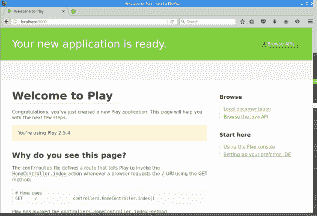
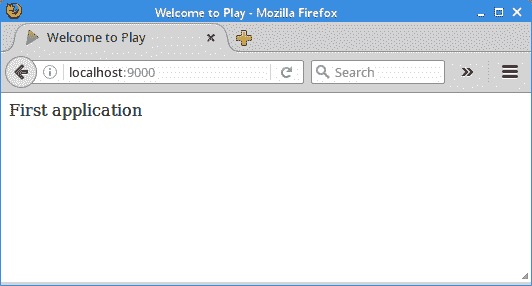

# Play 框架简介

原文：http://zetcode.com/java/play/

这是 Play 框架的入门教程。 我们使用 Play 创建简单的 Web 应用。 本教程使用 Play 版本 2.5。

播放是一个用 Scala 和 Java 编写的开源 Web 应用框架。 Play 由 Guillaume Bort 于 2007 年创建。Play 受 ASP.NET MVC，Ruby on Rails 和 Django 的极大启发。 Play 与 Dropwizard，Ninja 框架或 Jodd 等其他框架一起属于下一代 Java Web 框架。

使用 Model Miew Controller（MVC）体系结构模式构建播放。 传统的 MVC 模式将应用分为三个部分：模型，视图和控制器。 该模型表示应用中的数据。 视图是数据的视觉表示。 最后，控制器处理并响应事件（通常是用户操作），并可以调用模型上的更改。 这个想法是通过引入一个中间组件：控制器，将数据访问和业务逻辑与数据表示和用户交互分开。

为了优化开发人员的生产力，它使用约定而非配置和热代码重载。 优于配置的约定是一种软件设计范式，软件框架使用它来减少设置项目所需的工作。 诸如 Ruby on Rails 或 Play 之类的框架将合理的默认值用于项目结构，将对象属性与表列相关联或为视图命名。 该范式也称为约定编码。

## Play 的主要功能

以下是 Play 的主要功能列表：

*   Play 默认情况下将 JBoss Netty 用于 Web 服务器。
*   它使用 Scala SBT 构建工具来构建应用。
*   这是一个 RESTful 框架。
*   它具有基于 JPA 的持久层。
*   它使用 Scala 作为模板引擎。
*   它是一个完整的堆栈框架，其中包含许多常见开发任务的库，例如 JSON 解析，验证，持久性或身份验证。

Play 放弃了 Java Web 开发中使用的许多传统方法。 它不使用 servlet，也不会将项目打包到 WAR 档案中。 它不使用巨大的整体 Web 应用服务器（JBoss，Glassfish）和 XML 配置文件。

## 安装播放

Play 是 Maven 存储库中可用的一系列库。 可以使用任何构建工具来创建 Play 应用。 默认情况下，Play 使用 Sbt 构建工具（默认的 Scala 构建工具）创建 Play 应用。

要创建 Play 应用，我们使用称为激活器的工具。 Activator 包括一个 Sbt 构建工具，一组和项目模板以及一个用于管理项目的 Web 界面。 两个重要的种子模板是 Scala 开发人员使用的`play-scals`和 Java 开发人员使用的`play-java`。

从 Play 框架的[项目页面](https://www.playframework.com/download)中，我们下载了激活器。 我们建议下载整个脱机发行版。 下载发行版后，我们将软件包解压缩到所选目录。 我们将其放入主目录的`bin`子目录中。

```
$ export PATH=$PATH:~/bin/activator-dist-1.3.10/bin/

```

我们将激活器的`bin`目录添加到`PATH`变量中。

## 创建 Play 应用

现在，我们将创建一个新的 Play 应用。

```
$ activator new first play-java

```

该命令创建一个名为 first 的新 Play Java 应用。

```
$ cd first
$ tree
.
├── app
│   ├── controllers
│   │   ├── AsyncController.java
│   │   ├── CountController.java
│   │   └── HomeController.java
│   ├── filters
│   │   └── ExampleFilter.java
│   ├── Filters.java
│   ├── Module.java
│   ├── services
│   │   ├── ApplicationTimer.java
│   │   ├── AtomicCounter.java
│   │   └── Counter.java
│   └── views
│       ├── index.scala.html
│       └── main.scala.html
├── bin
│   ├── activator
│   └── activator.bat
├── build.sbt
├── conf
│   ├── application.conf
│   ├── logback.xml
│   └── routes
├── libexec
│   └── activator-launch-1.3.10.jar
├── LICENSE
├── project
│   ├── build.properties
│   └── plugins.sbt
├── public
│   ├── images
│   │   └── favicon.png
│   ├── javascripts
│   │   └── hello.js
│   └── stylesheets
│       └── main.css
├── README
└── test
    ├── ApplicationTest.java
    └── IntegrationTest.java

```

应用的源代码位于`app`目录中。 `bin`目录包含激活器工具。 `build.sbt`是应用构建脚本。 `conf`目录包含配置文件和其他未编译的资源。 `project`目录具有 sbt 配置文件。 `public`目录包含公共资产，例如静态 HTML 文件，JavaScript 文件，图像或 CSS 文件。 `test`目录是用于单元测试或功能测试的源文件夹。 在构建应用时，将生成新目录。 例如，`target`目录包含框架生成的文件。

```
$ activator run

```

在项目目录中，我们使用`activator run`命令运行该应用。 该应用中已经包含一些简单的代码。



Figure: First Play application


默认情况下，应用在端口 9000 上进行侦听。 请注意，由于应用是动态编译的，因此存在一些延迟。

现在，我们将对应用进行一些修改。

`routes`

```
# Routes
# This file defines all application routes (Higher priority routes first)
# ~~~~

# An example controller showing a sample home page
GET     /                           controllers.HomeController.index
# An example controller showing how to use dependency injection
GET     /count                      controllers.CountController.count
# An example controller showing how to write asynchronous code
GET     /message                    controllers.AsyncController.message

# Map static resources from the /public folder to the /assets URL path
GET     /assets/*file               controllers.Assets.versioned(path="/public", file: Asset)

```

在`conf/routes`文件中，我们定义了应用的所有路由。 路由器是将每个传入 HTTP 请求转换为操作调用的组件，该操作调用是控制器类中的公共方法。 我们可以看到根路由`/`调用了`HomeController`的`index()`方法。

`HomeController.java`

```
package controllers;

import play.mvc.Controller;
import play.mvc.Result;
import views.html.index;

/**
 * This controller contains an action to handle HTTP requests
 * to the application's home page.
 */
public class HomeController extends Controller {

    public Result index() {
        return ok(index.render("First application"));
    }
}

```

我们修改`HomeController`类。 `index()`方法返回`ok()`，生成 HTTP 200 OK 结果。 索引操作调用`render()`方法，该方法告诉 Play 渲染模板。 使用模板是生成 HTTP 响应的最常见方法。 我们没有明确指定应选择哪个模板，因此 Play 选择默认模板：`views/index.scala.html`。

`index.scala.html`

```
@(message: String)

@main("Welcome to Play") {

    @message
}

```

我们修改文件以包含上面的代码。 该模板也称为主模板。

`main.scala.html`

```
@(title: String)(content: Html)

<!DOCTYPE html>
<html lang="en">
    <head>
        <title>@title</title>
    </head>
    <body>
        @content
    </body>
</html>

```

这是主模板，从索引模板调用。 它用字符串数据填充标题和内容。



Figure: First Play application 2


现在，文档已删除，仅显示该消息。

## 简单的形式

我们创建一个可以使用 HTML 表单的应用。

```
$ activator new myform play-java

```

创建一个新的 Play 应用。

```
$ tree app
app
├── controllers
│   └── Application.java
├── filters
├── services
└── views
    ├── greet.scala.html
    ├── index.scala.html
    └── main.scala.html

4 directories, 4 files

```

我们删除`app`子目录中的所有现有文件。 我们创建一个 Java 文件和三个 HTML 文件。

`routes`

```
# Routes

GET      /                           controllers.Application.index
GET      /greet                      controllers.Application.greet

```

在`routes`文件中，我们有两个 GET 请求。

`Application.java`

```
package controllers;

import play.data.FormFactory;
import play.mvc.Controller;
import play.mvc.Result;
import views.html.index;

import javax.inject.Inject;

public class Application extends Controller {

    @Inject
    FormFactory formFactory;

    public Result index() {

        return ok(index.render("Enter your name:"));
    }

    public Result greet() {

        String name = formFactory.form().bindFromRequest().get("name");
        StringBuilder sb = new StringBuilder("Hello ");
        sb.append(name);

        return ok(sb.toString());
    }
}

```

我们有一个`Application`控制器。

```
@Inject
FormFactory formFactory;

```

我们注入`FormFactory`，它是用于创建表单的帮助程序类。

```
public Result index() {

    return ok(index.render("Enter your name:"));
}

```

`index()`操作将呈现一个页面，告诉用户输入其名称。

```
String name = formFactory.form().bindFromRequest().get("name");

```

我们将名称请求参数绑定到`name`变量。

```
StringBuilder sb = new StringBuilder("Hello ");
sb.append(name);

return ok(sb.toString());

```

我们构建并返回一条消息。

`index.scala.html`

```
@(message: String)

@main("My form") {

@message

    <form action="@routes.Application.greet", method="get">
        <input type="text" name="name" />
        <button>Submit</button>
    </form>

}

```

在`index.scala.html`文件中，我们有一个 HTML 表单，用于发送 GET 请求。

`greet.scala.html`

```
@(message: String)

@main("My form") {

    @message
}

```

`greet.scala.html`文件显示生成的消息。

`main.scala.html`

```
@(title: String)(content: Html)

<!DOCTYPE html>
<html lang="en">
    <head>
        <title>@title</title>
    </head>
    <body>

        @content
    </body>
</html>

```

`main.scala.html`文件是主模板文件，它与其他两个模板文件合并。

这是 Play 框架的简介。 您可能还需要查看相关的教程：[条纹教程](/java/stripes/)， [Java MVC 教程](/java/mvc/)， [Spark Java 入门](/java/spark/)， [Jtwig 教程](/java/jtwig/)， [Java 教程](/lang/java/)或 [SQL 查询标签教程](/java/sqlquerytag/)。