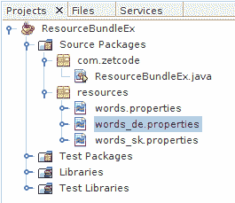
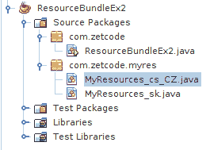
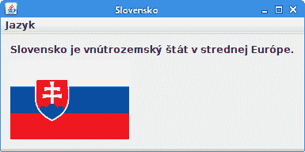
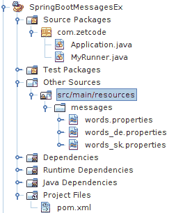

# Java ResourceBundle 教程

原文：http://zetcode.com/java/resourcebundle/

在 Java ResourceBundle 教程中，我们展示了如何在 Java 中使用`ResourceBundle`。

硬编码特定于语言环境的数据不是要走的路。 诸如消息或标签之类的值应放在单独的文件中。 这样，我们可以处理多个语言环境，而不必为每个语言环境编写不同的代码。 对于翻译人员来说，这也很方便，因为它们仅处理可翻译的文本，而不查看编程代码。

## Java ResourceBundle

资源包是 Java 属性文件，其中包含特定于语言环境的数据。 通过使代码与语言环境无关，这是使 Java 应用程序国际化的一种方式。

资源包捆绑到具有相同基本名称的族中。 例如，如果我们有一个`words`基本名称，则`words_sk`与斯洛伐克语的语言环境匹配。 如果不支持特定的语言环境，则使用默认资源束。

资源包还支持方言。 例如`words_es_AR`用于阿根廷使用的西班牙语，而玻利维亚使用`words_es_BO`。

`ResourceBundle`是一个抽象类，具有两个子类：`PropertyResourceBundle`和`ListResourceBundle`。 `PropertyResourceBundle`从属性文件加载数据。 属性文件是包含可翻译文本的纯文本文件。 属性文件不是 Java 源代码的一部分，它们只能包含 String 值。 `ListResourceBundle`通过方便的列表管理资源； 它从类文件中获取数据。 我们可以将任何特定于语言环境的对象存储在`ListResourceBundle`中。

为了获得适当的`ResourceBundle`，我们调用`ResourceBundle.getBundle()`方法。 这是一种寻找`ListResourceBundle`的工厂方法，如果找不到，将寻找`PropertyResourceBundle`。 如果找不到资源束，则抛出`MissingResourceException`。

## Java PropertyResourceBundle 示例

在第一个应用程序中，我们创建一个简单的 Java 应用程序，该应用程序使用三个资源包：默认的英语，德语和斯洛伐克语。

<figure>

<figcaption>Figure: NetBeans project structure</figcaption>

</figure>

我们创建三个属性文件，并将它们放置在`resources`目录中。

`words.properties`

```
w1 = Earth
w2 = ocean

```

这是默认属性文件。 它通常是英语。 文件中有两个词。

`words_de.properties`

```
w1 = Erde
w2 = ozean

```

`words_de.properties`文件包含德语单词。

`words_sk.properties`

```
w1 = Zem
w2 = oceán

```

`words_de.properties`文件包含斯洛伐克语单词。

`ResourceBundleEx.java`

```
package com.zetcode;

import java.util.Locale;
import java.util.ResourceBundle;

public class ResourceBundleEx {

    static public void main(String[] args) {

        Locale[] locales = {
            Locale.GERMAN,
            new Locale("sk", "SK"),
            Locale.ENGLISH
        };

        System.out.println("w1:");

        for (Locale locale : locales) {

            getWord(locale, "w1");
        }

        System.out.println("w2:");

        for (Locale locale : locales) {

            getWord(locale, "w2");
        }
    }

    static void getWord(Locale curLoc, String key) {

        ResourceBundle words
                = ResourceBundle.getBundle("resources/words", curLoc);

        String value = words.getString(key);

        System.out.printf("Locale: %s, Value: %s %n", curLoc.toString(), value);

    }
}

```

在代码示例中，我们打印了三个资源包中使用的所有单词。

```
Locale[] locales = {
    Locale.GERMAN,
    new Locale("sk", "SK"),
    Locale.ENGLISH
};

```

在示例中，我们有三种语言环境：德语，斯洛伐克语和英语。

```
for (Locale locale : locales) {

    getWord(locale, "w1");
}

```

我们遍历语言环境并打印带有`w1`键标记的单词。

```
ResourceBundle words
        = ResourceBundle.getBundle("resources/words", curLoc);

```

使用`ResourceBundle.getBundle()`方法，可以获得当前使用的语言环境的捆绑软件。 由于我们尚未创建`ListResourceBundle`，因此该方法使用`PropertyResourceBundle`，从而从属性文件加载数据。

```
String value = words.getString(key);

System.out.printf("Locale: %s, Value: %s %n", curLoc.toString(), value);

```

我们获取值并打印语言环境名称，键和值。

```
w1:
Locale: de, Value: Erde 
Locale: sk_SK, Value: Zem 
Locale: en, Value: Earth 
w2:
Locale: de, Value: ozean 
Locale: sk_SK, Value: oceán 
Locale: en, Value: ocean 

```

这是示例的输出。

## Java ListResourceBundle 示例

在以下应用程序中，我们使用`ListResourceBundle`。

<figure>

<figcaption>Figure: NetBeans project structure II</figcaption>

</figure>

我们为斯洛伐克语和捷克语创建语言环境资源。

`MyResources_sk.java`

```
package com.zetcode.myres;

import java.util.ListResourceBundle;

public class MyResources_sk extends ListResourceBundle {

    @Override
    protected Object[][] getContents() {

        return resources;
    }

    private final Object[][] resources = {

            { "Capital", "Bratislava" },       
            { "Area", 49035 },
            { "Currency", "EUR" },
    };
}

```

在这里，我们为斯洛伐克语实现了`ListResourceBundle`的实现。 我们必须重写`getContents()`方法。 该方法返回键/值对的数组。

`MyResources_cs_CZ.java`

```
package com.zetcode.myres;

import java.util.ListResourceBundle;

public class MyResources_cs_CZ extends ListResourceBundle {

    @Override
    protected Object[][] getContents() {

        return resources;
    }

    private final Object[][] resources = {

            { "Capital", "Praha" },       
            { "Area", 78866 },
            { "Currency", "CZK" },
    };
}

```

这是捷克语的实现。

`ResourceBundleEx2.java`

```
package com.zetcode;

import java.util.Locale;
import java.util.ResourceBundle;

public class ResourceBundleEx2 {

    public static void main(String[] args) {

        Locale sk_loc = new Locale("sk", "SK"); 
        ResourceBundle bundle = 
            ResourceBundle.getBundle("com.zetcode.myres.MyResources", sk_loc);

        System.out.println("Capital: " + bundle.getObject("Capital"));
        System.out.println("Area: " + bundle.getObject("Area"));
        System.out.println("Currency: " + bundle.getObject("Currency"));

        System.out.println();

        Locale cz_loc = new Locale("cs", "CZ"); 
        ResourceBundle bundle2 = 
            ResourceBundle.getBundle("com.zetcode.myres.MyResources", cz_loc);

        System.out.println("Capital: " + bundle2.getObject("Capital"));
        System.out.println("Area: " + bundle2.getObject("Area"));
        System.out.println("Currency: " + bundle2.getObject("Currency"));      
    }
}

```

该示例打印了斯洛伐克和捷克共和国的一些地理数据。

```
Locale sk_loc = new Locale("sk", "SK"); 
ResourceBundle bundle = 
    ResourceBundle.getBundle("com.zetcode.myres.MyResources", sk_loc);

```

使用`ResourceBundle.getBundle()`方法，我们从`com.zetcode.myres.MyResources_sk.class`创建资源束。

```
Capital: Bratislava
Area: 49035
Currency: EUR
Capital: Praha
Area: 78866
Currency: CZK

```

This is the output of the example.

## 秋千应用

在第三个示例中，我们使用 Java Swing 创建了一个简单的 GUI 应用程序。 该示例可以动态更改 UI 的语言。 该示例使用`ListResourceBundle`类。 对于不熟悉 Swing 的人，ZetCode 上有一个 [Java Swing 教程](http://zetcode.com/tutorials/javaswingtutorial/)。

源代码和图像可在作者的 [Github 存储库](https://github.com/janbodnar/Java-ResourceBundle)中获得。

`MyResources_sk.java`

```
package com.zetcode.myres;

import java.util.ListResourceBundle;
import javax.swing.ImageIcon;

public class MyResources_sk extends ListResourceBundle {

    @Override
    protected Object[][] getContents() {

        return resources;
    }

    private final Object[][] resources = {

        {"name", "Slovensko"},
        {"lang_menu", "Jazyk"},
        {"lang_sk", "Slovenčina"},
        {"lang_hu", "Maďarčina"},
        {"flag", new ImageIcon("src/resources/slovakia.png")},
        {"description", "Slovensko je vnútrozemský štát v strednej Európe."}
    };
}

```

这些是斯洛伐克语的资源。 我们有五个字符串和一个`ImageIcon`。

`MyResources_hu.java`

```
package com.zetcode.myres;

import java.util.ListResourceBundle;
import javax.swing.ImageIcon;

public class MyResources_hu extends ListResourceBundle {

    @Override
    protected Object[][] getContents() {

        return resources;
    }

    private final Object[][] resources = {

        {"name", "Magyarország"},
        {"lang_menu", "Nyelv"},
        {"lang_sk", "Szlovák"},
        {"lang_hu", "Magyar"},        
        {"flag", new ImageIcon("src/resources/hungary.png")},
        {"description", "Magyarország közép-európai ország "
            + "a Kárpát-medencében."}
    };
}

```

这些是匈牙利语的资源。

`ResourceBundleEx3.java`

```
package com.zetcode;

import java.awt.Container;
import java.awt.EventQueue;
import java.awt.event.ActionEvent;
import java.awt.event.KeyEvent;
import java.util.Locale;
import java.util.ResourceBundle;
import javax.swing.ButtonGroup;
import javax.swing.GroupLayout;
import javax.swing.Icon;
import javax.swing.JComponent;
import javax.swing.JFrame;
import javax.swing.JLabel;
import javax.swing.JMenu;
import javax.swing.JMenuBar;
import javax.swing.JRadioButtonMenuItem;
import javax.swing.LayoutStyle;

/*
 * Java ResourceBundle tutorial
 *
 * This program uses a ResourceBundle in a 
 * Java Swing application.
 *
 * Author: Jan Bodnar
 * Website: zetcode.com
 * Last modified: August 2016
 */
public class ResourceBundleEx3 extends JFrame {

    private ResourceBundle bundle;
    private JLabel flag;
    private JLabel lbl;
    private JMenu langMenu;
    private JRadioButtonMenuItem skMenuItem;
    private JRadioButtonMenuItem huMenuItem;

    public ResourceBundleEx3() {

        initUI();
    }

    private void initUI() {

        createMenuBar();

        flag = new JLabel();
        lbl = new JLabel();

        updateLanguage(new Locale("sk", "SK"));

        createLayout(lbl, flag);
        pack();

        setTitle(bundle.getString("name"));
        setLocationRelativeTo(null);
        setDefaultCloseOperation(EXIT_ON_CLOSE);
    }

    private void updateLanguage(Locale locale) {

        bundle = ResourceBundle.getBundle("com.zetcode.myres.MyResources", locale);
        langMenu.setText(bundle.getString("lang_menu"));
        skMenuItem.setText(bundle.getString("lang_sk"));
        huMenuItem.setText(bundle.getString("lang_hu"));
        flag.setIcon((Icon) bundle.getObject("flag"));
        lbl.setText(bundle.getString("description"));
        setTitle(bundle.getString("name"));
        pack();
    }

    private void createMenuBar() {

        JMenuBar menubar = new JMenuBar();

        langMenu = new JMenu();
        langMenu.setMnemonic(KeyEvent.VK_F);

        ButtonGroup btnGroup = new ButtonGroup();

        skMenuItem = new JRadioButtonMenuItem("Slovak", true);
        btnGroup.add(skMenuItem);

        skMenuItem.addActionListener((ActionEvent e) -> {
            updateLanguage(new Locale("sk", "SK"));
        });

        langMenu.add(skMenuItem);

        huMenuItem = new JRadioButtonMenuItem("Hungarian");
        btnGroup.add(huMenuItem);

        huMenuItem.addActionListener((ActionEvent e) -> {
            updateLanguage(new Locale("hu", "HU"));
        });

        langMenu.add(huMenuItem);

        menubar.add(langMenu);

        setJMenuBar(menubar);
    }

    private void createLayout(JComponent... arg) {

        Container pane = getContentPane();
        GroupLayout gl = new GroupLayout(pane);
        pane.setLayout(gl);

        gl.setAutoCreateContainerGaps(true);

        gl.setHorizontalGroup(gl.createParallelGroup()
                .addComponent(arg[0])
                .addComponent(arg[1])
        );

        gl.setVerticalGroup(gl.createSequentialGroup()
                .addComponent(arg[0])
                .addPreferredGap(LayoutStyle.ComponentPlacement.RELATED)
                .addComponent(arg[1])
        );
    }

    public static void main(String[] args) {

        EventQueue.invokeLater(() -> {
            ResourceBundleEx3 ex = new ResourceBundleEx3();
            ex.setVisible(true);
        });
    }
}

```

我们有一个菜单栏，其中的菜单包含两个单选按钮菜单项。 选择单选按钮菜单项会更改应用程序用户界面的语言。

```
private void updateLanguage(Locale locale) {

    bundle = ResourceBundle.getBundle("com.zetcode.myres.MyResources", locale);
    langMenu.setText(bundle.getString("lang_menu"));
    skMenuItem.setText(bundle.getString("lang_sk"));
    huMenuItem.setText(bundle.getString("lang_hu"));
    flag.setIcon((Icon) bundle.getObject("flag"));
    lbl.setText(bundle.getString("description"));
    setTitle(bundle.getString("name"));
    pack();
}

```

当我们选择单选按钮菜单项时，将调用`updateLanguage()`方法。 它根据给定的语言环境创建一个新的`ResourceBundle`，并更新菜单，单选菜单项，图像图标，说明和框架标题。

```
skMenuItem.addActionListener((ActionEvent e) -> {
    updateLanguage(new Locale("sk", "SK"));
});

```

选择斯洛伐克单选按钮菜单项，我们调用`updateLanguage()`方法并传递斯洛伐克语言环境作为参数。

<figure>

<figcaption>Figure: Swing application</figcaption>

</figure>

## Spring Boot 应用程序

在下一个示例中，我们在 Spring Boot 应用程序中使用资源包。 Spring 是流行的 Java 应用程序框架。 Spring Boot 是一种新的解决方案，可以轻松创建基于生产级别的独立 Spring 应用程序。

<figure>

<figcaption>Figure: NetBeans project structure of a Spring Boot application</figcaption>

</figure>

同样，我们创建三个属性文件，并将它们放置在`src/main/resources/messages`目录中。

`words.properties`

```
w1 = Earth
w2 = ocean

```

这是默认属性文件。

`words_de.properties`

```
w1 = Erde
w2 = ozean

```

The `words_de.properties` file contains words in German language.

`words_sk.properties`

```
w1 = Zem
w2 = oceán

```

The `words_de.properties` file contains words in Slovak language.

`pom.xml`

```
<?xml version="1.0" encoding="UTF-8"?>
<project xmlns="http://maven.apache.org/POM/4.0.0" 
         xmlns:xsi="http://www.w3.org/2001/XMLSchema-instance" 
         xsi:schemaLocation="http://maven.apache.org/POM/4.0.0 http://maven.apache.org/xsd/maven-4.0.0.xsd">
    <modelVersion>4.0.0</modelVersion>
    <groupId>com.zetcode</groupId>
    <artifactId>SpringBootMessagesEx</artifactId>
    <version>1.0-SNAPSHOT</version>
    <packaging>jar</packaging>
    <properties>
        <project.build.sourceEncoding>UTF-8</project.build.sourceEncoding>
        <maven.compiler.source>1.8</maven.compiler.source>
        <maven.compiler.target>1.8</maven.compiler.target>
    </properties>

    <parent>
        <groupId>org.springframework.boot</groupId>
        <artifactId>spring-boot-starter-parent</artifactId>
        <version>1.4.2.RELEASE</version>
        <relativePath />
    </parent>  

    <dependencies>

        <dependency>
            <groupId>org.springframework.boot</groupId>
            <artifactId>spring-boot-starter</artifactId>
        </dependency>

    </dependencies>
    <name>SpringBootMessagesEx</name>        
</project>

```

`pom.xml`文件包含 Spring Boot 框架的依赖项。

`Application.java`

```
package com.zetcode;

import org.springframework.boot.SpringApplication;
import org.springframework.boot.autoconfigure.SpringBootApplication;
import org.springframework.context.annotation.Bean;
import org.springframework.context.support.ResourceBundleMessageSource;

@SpringBootApplication
public class Application {

    @Bean
    public ResourceBundleMessageSource messageSource() {

        ResourceBundleMessageSource source = new ResourceBundleMessageSource();
        source.setBasenames("messages/words"); 
        source.setUseCodeAsDefaultMessage(true);

        return source;
    }

    public static void main(String[] args) {

        SpringApplication.run(Application.class, args);
    }
}

```

`Application`是主要的应用程序类。 我们设置了 Spring Boot 程序。

```
@Bean
public ResourceBundleMessageSource messageSource() {

    ResourceBundleMessageSource source = new ResourceBundleMessageSource();
    source.setBasenames("messages/words"); 
    source.setUseCodeAsDefaultMessage(true);

    return source;
}

```

使用`@Bean`批注，我们生成了一个`ResourceBundleMessageSource` bean，该 bean 由 Spring 容器管理。 `ResourceBundleMessageSource`是一种`MessageSource`实现，它使用指定的基本名称访问资源束。 此类依赖于基础 JDK 的`ResourceBundle`实现。

`MyRunner.java`

```
package com.zetcode;

import java.util.Locale;
import org.springframework.beans.factory.annotation.Autowired;
import org.springframework.boot.CommandLineRunner;
import org.springframework.context.MessageSource;
import org.springframework.stereotype.Component;

@Component
public class MyRunner implements CommandLineRunner {

    @Autowired
    private MessageSource messageSource;

    @Override
    public void run(String... args) throws Exception {

        System.out.println(messageSource.getMessage("w1", 
                null, Locale.GERMAN));
        System.out.println(messageSource.getMessage("w1", 
                null, Locale.ENGLISH));        
        System.out.println(messageSource.getMessage("w2", 
                null, new Locale("sk", "SK")));          
    }
}

```

`MyRunner`是 Spring Boot 应用程序的命令行运行程序。

```
@Autowired
private MessageSource messageSource;

```

我们将`MessageSource`注入到该字段中。

```
System.out.println(messageSource.getMessage("w1", 
        null, Locale.GERMAN));

```

我们使用`getMessage()`方法在德语语言环境中得到单词 w1。

```
...
Erde
Earth
oceán
...

```

这是应用程序的输出。

在本教程中，我们介绍了 Java `ResourceBundle`。 我们创建了两个 Java 控制台应用程序，一个 Swing 应用程序和一个 Spring Boot 应用程序。 您可能还需要查看相关的教程： [Spring MessageSource 教程](/spring/messagesource/)， [Java Swing 教程](/tutorials/javaswingtutorial/)， [Java 教程](/lang/java/)或[在 Java 教程中显示图像[](/java/displayimage/) 。