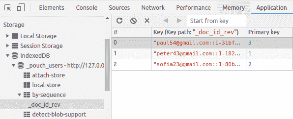

# PouchDB 教程

> 原文： [http://zetcode.com/javascript/pouchdb/](http://zetcode.com/javascript/pouchdb/)

PouchDB 教程展示了如何在 JavaScript 中使用 PouchDB。 本教程中的 PouchDB 代码示例可在数据库中插入，删除和删除文档。

## PouchDB

PouchDB 是 CouchDB 的 JavaScript 实现。 PouchDB 可以在浏览器中，在 Node 中本地使用，也可以通过 HTTP 协议远程使用。

默认情况下，PouchDB 随附用于浏览器的 IndexedDB 适配器，Node.js 中的 LevelDB 适配器和用于远程数据库的 CouchDB 适配器。

Apache CouchDB 是面向文档的开源 NoSQL 数据库。 它以 Erlang 语言实现，并使用 JSON 存储数据，将 JavaScript 作为其查询语言以及用于 API 的 HTTP。

## PouchDB 创建数据库

为了创建一个新的数据库，我们实例化了一个新的`PouchDB`对象。 如果数据库已经存在，它将创建对数据库的引用。

```
const db = new PouchDB('mydb');

```

我们创建一个新的 mydb 数据库。 根据运行的位置，它将在浏览器，Node 或远程 CouchDB 数据库服务器中创建一个新数据库。

## 浏览器中的 PouchDB

我们展示了如何在浏览器中使用 PouchDB。

`public/index.html`

```
<!DOCTYPE html>
<html lang="en">

<head>
    <meta charset="UTF-8">
    <meta name="viewport" content="width=device-width, initial-scale=1.0">
    <meta http-equiv="X-UA-Compatible" content="ie=edge">
    <title>Document</title>
</head>

<body>
    <script src="js/pouchdb-7.0.0.min.js"></script>
    <script>

        const db = new PouchDB('users');

        db.info()
            .then((info) => {
                console.log(info);
            })
    </script>
</body>

</html>

```

我们下载了`pouchdb`的缩小版，并将其包含在`script`标签中。 然后，我们创建一个新的`users`数据库，并将有关该数据库的一些信息写入控制台。 要检查创建的数据库，我们转到浏览器开发人员工具的存储检查器。



Figure: Storage browser in Chrome

这是 Google Chrome 浏览器中的存储浏览器。 只要选项卡存在，数据就是持久的。

## 在 Node 上安装 PouchDB

我们在 Node 上安装 PouchDB。

```
$ nodejs -v
v9.11.2

```

我们使用 Node 版本 9.11.2。

```
$ npm init -y
$ npm i pouchdb

```

我们创建一个新的 Node 项目并安装 PouchDB。

## PouchDB 创建文档

使用`put()`方法创建一个新的 PouchDB 文档。

`insert_doc.js`

```
const PouchDB = require('pouchdb');

const db = new PouchDB('mydb');

doc = {
    _id: new Date().toISOString(),
    name: 'Peter',
    age: 23,
    occupation: 'designer'
};

db.put(doc).then((res) => {
    console.log("Document inserted OK");
}).catch((err) => {
    console.error(err);
});

```

该示例在本地创建一个新的`mydb`数据库。

```
doc = {
    _id: new Date().toISOString(),
    name: 'Peter',
    age: 23,
    occupation: 'designer'
}

```

这是一个要插入数据库的新文档。 我们提供了`_id`。

```
db.put(doc).then((res) => {
    console.log("Document inserted OK");
}).catch((err) => {
    console.error(err);
});

```

该文档已插入数据库。

```
$ ls mydb/
000022.ldb  000024.ldb  000025.log  CURRENT  LOCK  LOG  LOG.old  MANIFEST-000023

```

在`mydb`目录中本地创建一个新数据库。

或者，我们可以使用`post()`创建一个新文档。 使用`post()`时，会自动为我们生成`_id`。

`insert_doc2.js`

```
const PouchDB = require('pouchdb');

const db = new PouchDB('mydb');

doc = {
    name: 'Peter',
    age: 23,
    occupation: 'designer'
};

db.post(doc).then((res) => {
    console.log("Document inserted OK");
}).catch((err) => {
    console.error(err);
});

```

在示例中，我们使用`post()`创建一个新文档。 为文档提供自动生成的`_id`，例如`b781309e-0423-4b3e-96ad-238cf50debce`。

## PouchDB 获取文件

要从数据库检索文档，我们使用`get()`函数。

`get_doc.js`

```
const PouchDB = require('pouchdb');

const db = new PouchDB('mydb');

db.get('b781309e-0423-4b3e-96ad-238cf50debce').then((doc) => {
    console.log(`${doc.name}, ${doc.age}, ${doc.occupation}`);
}).catch((err) => {
    console.error(err);
});

```

我们从数据库中检索文档。 我们为`get()`方法提供了`_id`。

```
$ node get_doc.js 
Peter, 23, designer

```

这是输出。

## PouchDB 删除文件

要从数据库中删除文档，我们使用`remove()`功能。

`get_doc.js`

```
const PouchDB = require('pouchdb');

const db = new PouchDB('mydb');

db.get('b781309e-0423-4b3e-96ad-238cf50debce').then((doc) => {
    return db.remove(doc);
}).then((res) => {
    console.log("The document has been removed");
}).catch((err) => {
    console.error(err);
});    

```

为了删除文档，我们必须先使用`get()`进行获取，然后再使用`remove()`进行删除。

## PouchDB bulkDocs

使用`bulkDocs()`方法，我们可以在单个批量操作中将许多文档写入数据库。

`create_users.js`

```
const PouchDB = require('pouchdb');

const db = new PouchDB('users');

doc1 = { _id: 'peter43@gmail.com', name: 'Peter', age: 23, occupation: 'designer' };
doc2 = { _id: 'sofia23@gmail.com', name: 'Sofia', age: 44, occupation: 'teacher' };
doc3 = { _id: 'paul54@gmail.com', name: 'Paul', age: 25, occupation: 'driver' };
docs = [doc1, doc2, doc3];

db.bulkDocs(docs).then((res) => {

    console.log("Documents inserted OK");
}).catch(() => {
    console.error(err);
});

```

在示例中，我们创建一个新的数据库用户，并使用`bulkDocs()`插入三个文档。

## PouchDB allDocs

`allDocs()`是另一个 PouchDB 批量方法； 一步即可检索许多文档。

`all_docs.js`

```
const PouchDB = require('pouchdb');

const db = new PouchDB('users');

db.allDocs({ include_docs: true, descending: true }, (err, doc) => {

    doc.rows.forEach(e => {
        console.log(e.doc);
    });

}).catch((err) => {
    console.error(err);
});;

```

在示例中，我们从`users`数据库中获取所有文档。

```
$ node all_docs.js 
{ name: 'Sofia',
  age: 44,
  occupation: 'teacher',
  _id: 'sofia23@gmail.com',
  _rev: '1-80b0fba21acf487fc20ac499e928acd7' }
{ name: 'Peter',
  age: 23,
  occupation: 'designer',
  _id: 'peter43@gmail.com',
  _rev: '1-182869c3c446731fa8b6106910b87d8e' }
{ name: 'Paul',
  age: 25,
  occupation: 'driver',
  _id: 'paul54@gmail.com',
  _rev: '1-31bfc20f010c9a6127cb44d6621cee5c' }

```

这是输出。

## PouchDB 更新文件

在下面的示例中，我们显示了如何更新文档。

`update_doc.js`

```
const PouchDB = require('pouchdb');

const db = new PouchDB('users');

db.get('sofia23@gmail.com').then((doc) => {

    doc.age = 45;
    return db.put(doc);    
}).then(() => {

    return db.get('sofia23@gmail.com');
}).then((doc) => {

    console.log(doc);
}).catch((err) => {

    console.error(err);
});

```

为了更新文档，我们对其进行检索，修改其属性并将其放回数据库。

在本教程中，我们使用了 PouchDB 数据库。 我们创建了一些代码示例，这些示例演示了如何创建与 PouchDB 交互的 JavaScript 程序。

您可能也对以下相关教程感兴趣： [JQuery 教程](/web/jquery/)， [Moment.js 教程](/javascript/momentjs/)，[从 JavaScript 中的 URL 读取 JSON](/articles/javascriptjsonurl/) ， [JavaScript Snake 教程](/javascript/snake/) ， [Node Sass 教程](/javascript/nodesass/)， [Lodash 教程](/javascript/lodash/)。