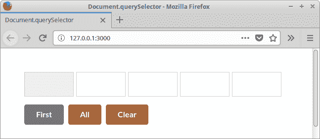

# `Document.querySelector`教程

> 标题： [http://zetcode.com/javascript/queryselector/](http://zetcode.com/javascript/queryselector/)

Document.querySelector 教程显示了如何使用`querySelector`选择 JavaScript 中的 HTML 元素。

## `Document.querySelector`

Document 的`querySelector()`方法返回文档中与指定选择器或一组选择器匹配的第一个 Element。 如果找不到匹配项，则返回 null。

`querySelectorAll()`返回一个静态 NodeList，代表与指定选择器组匹配的文档元素列表。

## `Document.querySelector`示例

下面的示例演示`querySelector()`和`querySelectorAll()`方法的用法。

`index.html`

```js
<!DOCTYPE html>
<html lang="en">
<head>
  <meta charset="UTF-8">
  <meta name="viewport" content="width=device-width, initial-scale=1.0">
  <title>Document.querySelector</title>
  <link rel="stylesheet" href="https://cdnjs.cloudflare.com/ajax/libs/semantic-ui/2.3.1/components/button.min.css">
<style>

body { margin: 3em }

.selected { background-color: #eee }

.container {
    display: grid;
    grid-template-columns: 100px 100px 100px 100px 100px;
    grid-template-rows: 50px;
    grid-column-gap:5px;
    margin-bottom: 1em;
}

div>div {
    border: 1px solid #ccc;
}

</style>
</head>
<body>

<div class="container">
<div></div>
<div></div>
<div></div>
<div></div>
<div></div>
</div>

<button id="first" type="submit" class="ui grey button">First</button>
<button id="all" type="submit" class="ui brown button">All</button>
<button id="clear" type="submit" class="ui brown button">Clear</button>

<script src="main.js"></script>

</body>
</html>

```

在文档中，我们显示五个带边框的 div 元素。 我们有三个按钮。 每个按钮都会更改 div 的外观。

```js
<link rel="stylesheet" href="https://cdnjs.cloudflare.com/ajax/libs/semantic-ui/2.3.1/components/button.min.css">

```

我们使用语义 UI 设置文档样式。

```js
.selected { background-color: #eee }

```

所选的 div 具有灰色背景色。

```js
.container {
    display: grid;
    grid-template-columns: 100px 100px 100px 100px 100px;
    grid-template-rows: 50px;
    grid-column-gap:5px;
    margin-bottom: 1em;
}

```

使用 CSS 网格布局系统将 div 一行显示。

```js
div>div {
    border: 1px solid #ccc;
}

```

容器 div 中的 div 具有灰色边框。

```js
<div class="container">
<div></div>
<div></div>
<div></div>
<div></div>
<div></div>
</div>

```

父容器 div 中有五个 div。

```js
<button id="first" type="submit" class="ui grey button">First</button>
<button id="all" type="submit" class="ui brown button">All</button>
<button id="clear" type="submit" class="ui brown button">Clear</button>

```

我们在文档中有三个按钮。 第一个按钮更改第一个内部 div 的背景颜色。 全部按钮更改所有内部 div。 并且“清除”按钮清除 div 的背景。 这些按钮具有语义 UI 样式。

```js
<script src="main.js"></script>

```

JavaScript 代码位于`main.js`文件中。

`main.js`

```js
document.getElementById("first").onclick = (e) => {

  let tag = document.querySelector(".container div:first-child");

  tag.className = "selected";

};

document.getElementById("all").onclick = (e) => {

  let tags = document.querySelectorAll(".container div");

  tags.forEach( tag => {
      tag.className = "selected";
  });

};

document.getElementById("clear").onclick = (e) => {

  let tags = document.querySelectorAll(".container div");
  tags.forEach( tag => {
      tag.classList.remove("selected");
  });

};

```

在`main.js`文件中，我们实现了按钮的功能。

```js
document.getElementById("first").onclick = (e) => {

```

单击侦听器将添加到具有`onclick`属性的按钮。 用`getElementById()`选择按钮。

```js
let tag = document.querySelector(".container div:first-child");

```

使用`querySelector()`方法，我们在容器 div 中选择了第一个内部 div。

```js
tag.className = "selected";

```

我们将`selected`类添加到所选标签。

```js
let tags = document.querySelectorAll(".container div");

```

使用`querySelectorAll()`，我们选择所有内部 div。

```js
tags.forEach( tag => {
  tag.className = "selected";
});

```

在`forEach()`循环中，我们遍历列表并将类附加到每个元素。



Figure: Selecting elements with Document.querySelector

在屏幕截图中，我们可以看到第一个 div 的背景色已更改。

在本教程中，我们使用了`querySelector()`和`querySelectorAll()`方法。

您可能也对以下相关教程感兴趣： [JavaScript Lodash 教程](/javascript/lodash/)， [Document.all 教程](/javascript/documentall/)， [JSON Server 教程](/javascript/jsonserver/)，[从 URL 中读取 JSON JavaScript](/articles/javascriptjsonurl/) ， [JavaScript Snake 教程](/javascript/snake/)， [JQuery 教程](/web/jquery/)， [jQuery Autocomplete 教程](/articles/jqueryautocomplete/)或[使用 jQuery DatePicker](/articles/jquerydatepicker/) 。