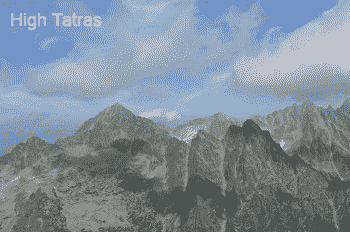

# 枕头教程

> 原文： [http://zetcode.com/python/pillow/](http://zetcode.com/python/pillow/)

枕头教程展示了如何在 Python 中使用枕头来处理图像。 来源可从作者的 Github [存储库](https://github.com/janbodnar/pillow-examples)中获得。

## 枕头

枕头是 Python 影像库（PIL），它增加了对打开，操作和保存图像的支持。 当前版本标识并读取大量格式。 有意将写支持限制为最常用的交换和表示格式。

## 显示图片

在第一个示例中，我们读取图像文件并在外部程序中显示它。

`show_image.py`

```
#!/usr/bin/python3

from PIL import Image
import sys

try:
    tatras = Image.open("tatras.jpg")

except IOError:
    print("Unable to load image")
    sys.exit(1)

tatras.show()

```

该程序读取 JPG 图像并将其显示在外部应用程序中。

```
from PIL import Image

```

在 PIL 模块中，我们包含`Image`类。

```
tatras = Image.open("tatras.jpg")

```

`Image.open()`方法读取图像文件。 枕头可以读取 30 多种不同的文件格式。

```
tatras.show()

```

`show()`方法主要用于调试目的。 它将图像保存到一个临时文件中并在外部程序中显示。 在 Linux 上可以是 ImageMagic，在 Windows 上可以是 Paint。

## 枕头的基本图像信息

枕头使我们可以获得有关图像的一些基本信息。

`basic_info.py`

```
#!/usr/bin/python3

from PIL import Image
import sys

try:
    tatras = Image.open("tatras.jpg")

except IOError:
    print("Unable to load image")
    sys.exit(1)

print("Format: {0}\nSize: {1}\nMode: {2}".format(tatras.format, 
    tatras.size, tatras.mode))

```

该示例使用 Pillow 打印有关图像的基本信息。

```
print("Format: {0}\nSize: {1}\nMode: {2}".format(tatras.format, 
    tatras.size, tatras.mode)) 

```

我们打印图像格式，大小和模式。

```
$ ./basic_info.py 
Format: JPEG
Size: (350, 232)
Mode: RGB

```

这是程序的输出。

## 影像模糊

`ImageFilter`模块包含一组预定义的过滤器的定义，可以与`filter()`方法一起使用。

`blur_image.py`

```
#!/usr/bin/python3

from PIL import Image, ImageFilter
import sys

try:
    img = Image.open("tatras.jpg")

except IOError:
    print("Unable to load image")    
    sys.exit(1)

blurred = img.filter(ImageFilter.BLUR)

blurred.save("blurred.png")

```

该程序加载图像，从原始图像创建模糊图像，然后将新图像保存在磁盘上。

```
from PIL import Image, ImageFilter

```

我们导入`Image`和`ImageFilter`模块。

```
blurred = img.filter(ImageFilter.BLUR)

```

我们将`ImageFilter.BLUR`应用于原始图像； 该操作将返回一个新的修改图像。

```
blurred.save("blurred.png")

```

使用`save()`方法，我们将模糊的图像保存在磁盘上。

## 用枕头转换图像

使用`save()`方法，我们可以将图像转换为其他格式。

`convert2png.py`

```
#!/usr/bin/python3

from PIL import Image
import sys

try:
    tatras = Image.open("tatras.jpg")

except IOError:
    print("Unable to load image")
    sys.exit(1)

tatras.save('tatras.png', 'png')  

```

该程序读取 JPG 图像并将其转换为 PNG 格式。

```
tatras.save('tatras.png', 'png')  

```

`save()`方法的第二个参数指定图像格式。

## 灰度图像

使用`Image.convert()`方法，我们可以产生黑白图像。

`grayscale.py`

```
#!/usr/bin/python3

from PIL import Image
import sys

try:
    tatras = Image.open("tatras.jpg")

except IOError:
    print("Unable to load image")
    sys.exit(1)

grayscale = tatras.convert('L')
grayscale.show()

```

该程序读取图像并将其转换为灰度图像。

```
grayscale = tatras.convert('L')

```

`convert()`方法的第一个参数是 mode； “ L”模式是黑白的。

## 用枕头裁剪图像

`Image.crop()`裁剪图像。

`crop_image.py`

```
#!/usr/bin/python3

from PIL import Image
import sys

try:
    tatras = Image.open("tatras.jpg")

except IOError:
    print("Unable to load image")
    sys.exit(1)

cropped = tatras.crop((100, 100, 350, 350))
cropped.save('tatras_cropped.jpg')

```

该程序将裁剪图像。 裁剪后的图像保存在磁盘上。

```
cropped = tatras.crop((100, 100, 350, 350))

```

`crop()`方法采用 4 个元组来定义左，上，右和下像素坐标。

## 用枕头旋转图像

`Image.rotate()`返回图像的旋转副本。

`rotate_image.py`

```
#!/usr/bin/python3

from PIL import Image
import sys

try:
    tatras = Image.open("tatras.jpg")

except IOError:
    print("Unable to load image")
    sys.exit(1)

rotated = tatras.rotate(180)
rotated.save('tatras_rotated.jpg') 

```

该程序将图像旋转 180 度并将新创建的图像保存在磁盘上。

## 在 Tkinter 中显示图像

以下程序在 Tkinter 程序中显示图像。

`show_tkinter.py`

```
#!/usr/bin/python3
# -*- coding: utf-8 -*-

from PIL import Image, ImageTk
from tkinter import Tk
from tkinter.ttk import Frame, Label
import sys

class Example(Frame):

    def __init__(self):
        super().__init__()   

        self.loadImage() 
        self.initUI()

    def loadImage(self):
        try:
            self.img = Image.open("tatrs.jpg")

        except IOError:
            print("Unable to load image")
            sys.exit(1)

    def initUI(self):

        self.master.title("Label")

        tatras = ImageTk.PhotoImage(self.img)
        label = Label(self, image=tatras)

        # reference must be stored
        label.image = tatras

        label.pack()
        self.pack()

    def setGeometry(self):

        w, h = self.img.size
        self.master.geometry(("%dx%d+300+300") % (w, h))

def main():

    root = Tk()
    ex = Example()
    ex.setGeometry()
    root.mainloop()  

if __name__ == '__main__':
    main()  

```

该程序在 Tkinter 工具箱的`Label`小部件中显示图像。

```
from PIL import Image, ImageTk

```

`ImageTk`是 Tkinter 兼容的照片图像。 它可以在 Tkinter 需要图像对象的任何地方使用。

```
tatras = ImageTk.PhotoImage(self.img)

```

我们创建照片图像。

```
label = Label(self, image=tatras)

```

将照片图像提供给标签窗口小部件的`image`参数。

```
label.image = tatras

```

为了不被垃圾收集，必须存储图像参考。

```
w, h = self.img.size
self.master.geometry(("%dx%d+300+300") % (w, h))

```

窗口的大小适合图像大小。

## 从 URL 读取图像

下一个示例从 URL 读取图像。

`read_from_url.py`

```
#!/usr/bin/python3

from PIL import Image
import requests
import sys

url = 'https://i.ytimg.com/vi/vEYsdh6uiS4/maxresdefault.jpg'

try:
    resp = requests.get(url, stream=True).raw

except requests.exceptions.RequestException as e:  
    sys.exit(1)

try:
    img = Image.open(resp)

except IOError:
    print("Unable to open image")
    sys.exit(1)

img.save('sid.jpg', 'jpeg')    

```

该示例从 URL 读取图像并将其保存在磁盘上。

```
import requests

```

我们使用`requests`库下载图像。

```
resp = requests.get(url, stream=True).raw

```

我们将图像读取为原始数据。

```
img = Image.open(resp)

```

`Image`是从响应对象创建的。

```
img.save('sid.jpg', 'jpeg')

```

图像被保存。

## 绘制到枕头图像

枕头具有一些基本的 2D 图形功能。 `ImageDraw`模块为`Image`对象提供简单的 2D 图形。 我们可以创建新图像，注释或修饰现有图像，以及即时生成图形以供 Web 使用。

`draw2image.py`

```
#!/usr/bin/python3

from PIL import Image, ImageDraw

img = Image.new('RGBA', (200, 200), 'white')    
idraw = ImageDraw.Draw(img)

idraw.rectangle((10, 10, 100, 100), fill='blue')

img.save('rectangle.png')

```

该示例创建一个新图像，并在图像上绘制一个蓝色矩形。

```
img = Image.new('RGBA', (200, 200), 'white') 

```

创建一个新的`Image`。 图像模式为“ RGBA”。 尺寸为 200x200，背景为白色。

```
idraw = ImageDraw.Draw(img)

```

根据图像，我们创建`ImageDraw`对象。 现在我们可以在图像上执行一些绘制操作。

```
idraw.rectangle((10, 10, 100, 100), fill='blue')

```

使用`rectangle()`方法，我们在图像上绘制了一个蓝色矩形。

## 用枕头创建水印

以下示例创建一个水印。

`watermark.py`

```
#!/usr/bin/python3

from PIL import Image, ImageDraw, ImageFont
import sys

try:
    tatras = Image.open("tatras.jpg")

except:
    print("Unable to load image")
    sys.exit(1)

idraw = ImageDraw.Draw(tatras)
text = "High Tatras"

font = ImageFont.truetype("arial.ttf", size=18)

idraw.text((10, 10), text, font=font)

tatras.save('tatras_watermarked.png')

```

我们使用`ImageDraw`模块创建水印。

```
font = ImageFont.truetype("arial.ttf", size=18)

```

我们创建 18 大小的 Arial 字体。

```
idraw.text((10, 10), text, font=font)

```

水印是通过`text()`方法创建的。 文本的默认颜色是白色。 我们使用创建的字体。



Figure: High Tatras

在本教程中，我们使用了 Python Pillow 库。

您可能也对以下相关教程感兴趣： [Tkinter 教程](/tkinter/)， [Matplotlib 教程](/python/matplotlib/)， [Python 箭头教程](/python/arrow/)， [PyQt5 教程](/gui/pyqt5/)和[ [Python 教程](/lang/python/)。