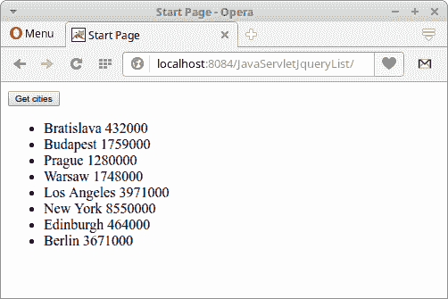

# Java Servlet JQuery 列表教程

> 原文： [http://zetcode.com/articles/javaservletjquerylist/](http://zetcode.com/articles/javaservletjquerylist/)

在 Java Servlet JQuery 列表教程中，我们展示了如何使用 JQuery 从 Java servlet 中获取数据并将其显示在 HTML 列表中。 我们使用 Gson 库处理 JSON 数据格式。 该 Web 应用已部署在 Tomcat 服务器上。

Apache Tomcat 是由 Apache 软件基金会（ASF）开发的开源 Java Servlet 容器。 它是最流行的 Java Web 服务器。

## Java Servlet

Servlet 是 Java 类，可响应特定类型的网络请求-最常见的是 HTTP 请求。 Java servlet 用于创建 Web 应用。 它们在 servlet 容器（例如 Tomcat 或 Jetty）中运行。 现代 Java Web 开发使用在 servlet 之上构建的框架。

## JSON 格式

JSON（JavaScript 对象表示法）是一种轻量级的数据交换格式。 人类很容易读写，机器也很容易解析和生成。 与 XML 相比，它不那么冗长且更具可读性。 JSON 的官方 Internet 媒体类型为`application/json`。 JSON 文件扩展名是`.json`。 JSON 可直接由 JavaScript 使用。

## Gson

Gson 是一个开放源代码 Java 库，用于将 Java 对象序列化和反序列化到 JSON 或从 JSON 反序列化。 Gson 由 Google 创建。

## Java servlet JQuery 列表示例

以下 Web 应用使用 Java Servlet 将数据（城市列表）以 JSON 格式发送到客户端。 JQuery 用于执行请求并动态构建 HTML 列表。

```java
├── pom.xml
└── src
    ├── main
    │   ├── java
    │   │   └── com
    │   │       └── zetcode
    │   │           ├── bean
    │   │           │   └── City.java
    │   │           ├── service
    │   │           │   └── CityService.java
    │   │           └── web
    │   │               └── GetCities.java
    │   ├── resources
    │   └── webapp
    │       ├── index.html
    │       ├── META-INF
    │       │   └── context.xml
    │       └── WEB-INF
    └── test
        └── java

```

这是项目结构。

`pom.xml`

```java
<?xml version="1.0" encoding="UTF-8"?>
<project xmlns="http://maven.apache.org/POM/4.0.0" 
         xmlns:xsi="http://www.w3.org/2001/XMLSchema-instance" 
         xsi:schemaLocation="http://maven.apache.org/POM/4.0.0 
http://maven.apache.org/xsd/maven-4.0.0.xsd">
    <modelVersion>4.0.0</modelVersion>

    <groupId>com.zetcode</groupId>
    <artifactId>JavaServleJqueryList</artifactId>
    <version>1.0-SNAPSHOT</version>
    <packaging>war</packaging>

    <name>JavaServleJqueryList</name>

    <properties>
        <project.build.sourceEncoding>UTF-8</project.build.sourceEncoding>
        <maven.compiler.source>1.8</maven.compiler.source>
        <maven.compiler.target>1.8</maven.compiler.target>
    </properties>

    <dependencies>

        <dependency>
            <groupId>javax.servlet</groupId>
            <artifactId>javax.servlet-api</artifactId>
            <version>3.1.0</version>
            <scope>provided</scope>
        </dependency>

        <dependency>
            <groupId>com.google.code.gson</groupId>
            <artifactId>gson</artifactId>
            <version>2.8.0</version>
        </dependency>

    </dependencies>

    <build>
        <plugins>

            <plugin>
                <groupId>org.apache.maven.plugins</groupId>
                <artifactId>maven-war-plugin</artifactId>
                <version>2.3</version>
                <configuration>
                    <failOnMissingWebXml>false</failOnMissingWebXml>
                </configuration>
            </plugin>

        </plugins>
    </build>
</project>

```

这是 Maven POM 文件。 我们有两个工件：用于 Java servlet 的`javax.servlet-api`和用于 Java JSON 处理的`gson`。 `maven-war-plugin`负责收集 Web 应用的所有工件依赖项，类和资源，并将它们打包到 Web 应用存档（WAR）中。

`context.xml`

```java
<?xml version="1.0" encoding="UTF-8"?>
<Context path="/JavaServleJqueryList"/>

```

在 Tomcat `context.xml`文件中，我们定义了上下文路径。 它是 Web 应用的名称。

`City.java`

```java
package com.zetcode.bean;

import com.google.gson.annotations.Expose;

public class City {

    private Long id;

    @Expose
    private String name;
    @Expose
    private int population;

    public City() {
    }

    public City(Long id, String name, int population) {
        this.id = id;
        this.name = name;
        this.population = population;
    }

    public Long getId() {
        return id;
    }

    public void setId(Long id) {
        this.id = id;
    }

    public String getName() {
        return name;
    }

    public void setName(String name) {
        this.name = name;
    }

    public int getPopulation() {
        return population;
    }

    public void setPopulation(int population) {
        this.population = population;
    }

    @Override
    public String toString() {
        return "City{" + "id=" + id + ", name=" + name + 
                ", population=" + population + '}';
    }
}

```

这是`City` bean。 它具有三个属性：id，名称和人口。 Gson 的`@Expose`批注指示应公开哪些成员以进行 JSON 序列化或反序列化。 在我们的例子中，我们忽略了 ID，因为它与客户无关。 这样我们可以节省一些带宽。

`GetCities.java`

```java
package com.zetcode.web;

import com.google.gson.Gson;
import com.google.gson.GsonBuilder;
import com.zetcode.bean.City;
import com.zetcode.service.CityService;
import java.io.IOException;
import java.io.PrintWriter;
import java.util.List;
import javax.servlet.ServletException;
import javax.servlet.annotation.WebServlet;
import javax.servlet.http.HttpServlet;
import javax.servlet.http.HttpServletRequest;
import javax.servlet.http.HttpServletResponse;

@WebServlet(name = "GetCities", urlPatterns = {"/GetCities"})
public class GetCities extends HttpServlet {

    @Override
    protected void doGet(HttpServletRequest request, HttpServletResponse response)
            throws ServletException, IOException {

        response.setContentType("application/json;charset=UTF-8");

        try (PrintWriter out = response.getWriter()) {

            List<City> cities = CityService.getCities();

            Gson gson = new GsonBuilder()
                    .excludeFieldsWithoutExposeAnnotation()
                    .create();

            out.print(gson.toJson(cities));
        }
    }
}

```

这是`GetCities` servlet。 它从服务类检索数据，并将它们以 JSON 格式返回给客户端。

```java
response.setContentType("application/json;charset=UTF-8");

```

我们将响应对象的内容类型设置为`application/json`。

```java
try (PrintWriter out = response.getWriter()) {

```

我们得到了`PrintWriter`，用于将字符文本发送到客户端。

```java
List<City> cities = CityService.getCities();

```

从`CityService`中，我们可以获得城市列表。

```java
Gson gson = new GsonBuilder()
        .excludeFieldsWithoutExposeAnnotation()
        .create();

```

我们创建并配置`Gson`类，这是使用 Gson 的主要类。 `excludeFieldsWithoutExposeAnnotation()`启用`@Expose`批注。

```java
out.print(gson.toJson(cities));

```

使用`toJson()`方法，我们将 Java 列表转换为 JSON 数组。 数组被写入编写器。 数组未命名。

`CityService.java`

```java
package com.zetcode.service;

import com.zetcode.bean.City;
import java.util.ArrayList;
import java.util.List;

public class CityService {

    public static List<City> getCities() {

        List<City> cities = new ArrayList<>();

        cities.add(new City(1L, "Bratislava", 432000));
        cities.add(new City(2L, "Budapest", 1759000));
        cities.add(new City(3L, "Prague", 1280000));
        cities.add(new City(4L, "Warsaw", 1748000));
        cities.add(new City(5L, "Los Angeles", 3971000));
        cities.add(new City(6L, "New York", 8550000));
        cities.add(new City(7L, "Edinburgh", 464000));
        cities.add(new City(8L, "Berlin", 3671000));

        return cities;
    }
}

```

`CityService's` `getCities()`方法返回城市对象的列表。

`index.html`

```java
<!DOCTYPE html>
<html>
    <head>
        <title>Start Page</title>
        <meta charset="UTF-8">
        <script src="https://code.jquery.com/jquery-3.2.1.min.js"></script> 
    </head>
    <body>

        <button id="mybtn">Get cities</button>

        <div>
            <ul id="output">

            </ul>
        </div>

        <script>
            $('#mybtn').click(function () {

                $.getJSON('GetCities', function (data) {

                    $("ul#output > li").remove();

                    $.each(data, function (key, value) {
                        $("#output").append('<li>' + value['name'] + " " + value['population'] + '</li>');
                    });
                });
            });
        </script>
    </body>
</html>

```

这是主页。

```java
<script src="https://code.jquery.com/jquery-3.2.1.min.js"></script> 

```

我们包括 JQuery 库。

```java
<button id="mybtn">Get cities</button>

```

该按钮执行请求。

```java
<div>
    <ul id="output">

    </ul>
</div>

```

返回的数据将被写入这些元素内。

```java
$('#mybtn').click(function () {

    $.getJSON('GetCities', function (data) {

        $("ul#output > li").remove();

        $.each(data, function (key, value) {
            $("#output").append('<li>' + value['name'] + " " + value['population'] + '</li>');
        });
    });
});

```

我们为按钮添加一个 click 事件处理程序。 `$.getJSON()`方法使用 GET HTTP 请求从`GetCities` Servlet 加载 JSON 编码的数据。 使用`remove()`方法，我们删除以前的元素（如果存在）。 使用`$.each()`，我们遍历 JSON 数据并将其附加到`&lt;li&gt;`标签内部的输出中。



Figure: Java Servlet JQuery list example

在图中，我们可以看到 HTML 列表中的数据：城市及其人口。

在本教程中，我们使用了 JQuery 从 Java servlet 获取 JSON 数据并构建 HTML 列表。

您可能也对以下相关教程感兴趣： [Gson 教程](/java/gson/)， [Java servlet JSON 教程](/articles/javaservletjson/)，[从 Java Servlet 提供纯文本](/articles/javaservlettext/)， [Java servlet 检查 盒子教程](/articles/javaservletcheckbox/)， [Java servlet 图像教程](/articles/javaservletimage/)， [Java Servlet HTTP 标头](/articles/javaservlethttpheaders/)或 [Java 教程](/lang/java/)