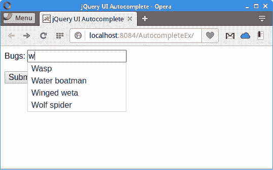

# jQuery 自动完成教程

> 原文： [http://zetcode.com/articles/jqueryautocomplete/](http://zetcode.com/articles/jqueryautocomplete/)

在 jQuery Autocomplete 教程中，我们展示了如何使用 jQuery Autocomplete 组件。 自动完成组件显示来自 Java servlet 的过滤数据。 作者的 Github [信息库](https://github.com/janbodnar/jQuery-Autocomple)中提供了本教程的源代码。

jQuery 是一个快速，小型且功能丰富的 JavaScript 库。 通过易于使用的 API（可在多种浏览器中使用），它使 HTML 文档的遍历和操作，事件处理，动画和 Ajax 变得更加简单。 jQuery UI 是在 jQuery 库顶部构建的一组用户界面小部件，效果，交互作用和主题。

`Autocomplete`是`jQuery UI`库的 UI 小部件之一。 当我们键入该字段时，它会提供建议。

JSON（JavaScript 对象表示法）是一种轻量级的数据交换格式。 人类很容易读写，机器也很容易解析和生成。 JSON 的官方 Internet 媒体类型为`application/json`。 JSON 文件扩展名是`.json`。 Java 中有许多库可以处理 JSON 数据格式； 其中一位是杰克逊。

## jQuery 自动完成示例

在下面的示例中，我们使用`Autocomplete`组件选择一个错误名称。 错误名称存储在服务器上的 CSV 文件中。 选定的错误名称将发送并显示在 JSP 页面中。

`pom.xml`

```
<?xml version="1.0" encoding="UTF-8"?>
<project xmlns="http://maven.apache.org/POM/4.0.0" 
         xmlns:xsi="http://www.w3.org/2001/XMLSchema-instance" 
         xsi:schemaLocation="http://maven.apache.org/POM/4.0.0 
http://maven.apache.org/xsd/maven-4.0.0.xsd">

    <modelVersion>4.0.0</modelVersion>

    <groupId>com.zetcode</groupId>
    <artifactId>AutocompleteEx</artifactId>
    <version>1.0-SNAPSHOT</version>
    <packaging>war</packaging>

    <name>AutocompleteEx</name>

    <properties>
        <project.build.sourceEncoding>UTF-8</project.build.sourceEncoding>
        <maven.compiler.source>1.8</maven.compiler.source>
        <maven.compiler.target>1.8</maven.compiler.target>        
    </properties>  

    <dependencies>

        <dependency>
            <groupId>javax.servlet</groupId>
            <artifactId>javax.servlet-api</artifactId>
            <version>4.0.0</version>
            <scope>provided</scope>
        </dependency>

        <dependency>
            <groupId>com.fasterxml.jackson.core</groupId>
            <artifactId>jackson-core</artifactId>
            <version>2.9.2</version>
        </dependency>

        <dependency>
            <groupId>com.fasterxml.jackson.core</groupId>
            <artifactId>jackson-databind</artifactId>
            <version>2.9.2</version>
        </dependency>

        <dependency>
            <groupId>com.opencsv</groupId>
            <artifactId>opencsv</artifactId>
            <version>4.0</version>
        </dependency>    

    </dependencies>

    <build>
        <plugins>

            <plugin>
                <groupId>org.apache.maven.plugins</groupId>
                <artifactId>maven-war-plugin</artifactId>
                <version>2.3</version>
                <configuration>
                    <failOnMissingWebXml>false</failOnMissingWebXml>
                </configuration>
            </plugin>

        </plugins>
    </build>                   

</project>

```

我们在项目中使用这些依赖项。 `javax.servlet-api`依赖性提供对 Java Servlet 的支持。 `com.fasterxml.jackson.core`和`jackson-databind`是用于处理 JSON 文件的 Jackson JAR。 `opencsv`用于处理 CSV 文件。

`index.html`

```
<!DOCTYPE html>
<html>
    <head>
        <title>jQuery UI Autocomplete</title>
        <meta charset="UTF-8">
        <meta name="viewport" content="width=device-width, initial-scale=1">
        <style>
            .ui-autocomplete-loading {
                background: white url("img/anim_16x16.gif") right center no-repeat;
            }
        </style>
        <link rel="stylesheet" href="//code.jquery.com/ui/1.12.1/themes/base/jquery-ui.css">

        <script src="https://code.jquery.com/jquery-1.12.4.js"></script>
        <script src="https://code.jquery.com/ui/1.12.1/jquery-ui.js"></script>
        <script>
            $(function () {

                $("#bugs").autocomplete({
                    source: "Bugs",
                    minLength: 1,
                });
            });
        </script>
    </head>
    <body>

        <form action="showBug.jsp">

            <div class="ui-widget">
                <label for="bugs">Bugs:</label>
                <input id="bugs" name="bug">
            </div>
            <br>
            <div>
                <input class="ui-widget" type="submit" value="Submit">
            </div>

        </form>

    </body>
</html>

```

在`index.html`文件中，我们在表单标签中使用`Autocomplete`组件。 `action`属性指向`showBug.jsp`页面，该页面显示所选的错误名称。

```
<link rel="stylesheet" href="//code.jquery.com/ui/1.12.1/themes/base/jquery-ui.css">
<script src="https://code.jquery.com/jquery-1.12.4.js"></script>
<script src="https://code.jquery.com/ui/1.12.1/jquery-ui.js"></script>

```

我们包括`Autocomplete`组件的 JavaScript 库和 CSS 样式。

```
<script>
    $(function () {

        $("#bugs").autocomplete({
            source: "Bugs",
            minLength: 1,
        });
    });
</script>

```

`Autocomplete`组件已创建。 `source`选项指向`Bugs` Servlet，该 Servlet 以 JSON 格式返回数据。 `minLength`选项指定用户在执行搜索之前必须键入的最少字符数。

```
<input id="bugs" name="bug">

```

`Autocomplete`绑定到该输入标签。

`showBug.jsp`

```
<%@page contentType="text/html" pageEncoding="UTF-8"%>
<!DOCTYPE html>
<html>
    <head>
        <meta charset="UTF-8">
        <title>Bug</title>
    </head>
    <body>
        <p>
            Chosen bug: <%= request.getParameter("bug")%>
        </p>
    </body>
</html>

```

在`showBug.jsp` JSP 文件中，打印选定的错误。

`bugs.csv`

```
Assasin bug, Avondale spider, Backswimmer, 
Bamboo moth, Banana moth, Bed bug,
Black cocroach, Blue moon, Bumble Bee,
Carpenter Bee, Cattle tick, Cave Weta,
Cicada, Cinnibar, Click beetle, Clothes moth,
Codling moth, Centipede, Earwig, Eucalypt longhorn beetle,
Field Grasshopper, Garden slug, Garden soldier,
German cockroach, German wasp, Giant dragonfly,
Giraffe weevil, Grass grub, Grass looper,
Green planthopper, Green house spider, Gum emperor,
Gum leaf skeletoniser, Hornet, Mealybug,
Mites, Mole Cricket, Monarch butterfly,
Mosquito, Silverfish, Wasp,
Water boatman, Winged weta, Wolf spider,
Yellow Jacket, Yellow Admiral

```

在`WEB-INF/bug.csv`文件中，我们列出了一个错误名称。 当 Web 应用程序从客户端收到 GET 请求时，将加载这些名称。

`Bugs.java`

```
package com.zetcode.web;

import com.zetcode.service.ReadBugs;
import com.zetcode.util.Utils;
import java.io.IOException;
import java.util.List;
import javax.servlet.ServletException;
import javax.servlet.annotation.WebServlet;
import javax.servlet.http.HttpServlet;
import javax.servlet.http.HttpServletRequest;
import javax.servlet.http.HttpServletResponse;

@WebServlet(name = "Bugs", urlPatterns = {"/Bugs"})
public class Bugs extends HttpServlet {

    @Override
    protected void doGet(HttpServletRequest request, HttpServletResponse response)
            throws ServletException, IOException {

        response.setContentType("application/json");
        response.setCharacterEncoding("UTF-8");

        String term = request.getParameter("term");
        String q = term.toLowerCase();

        List<String> bugsList = ReadBugs.readAll(getServletContext());
        List<String> filteredBugsList = Utils.filterListByTerm(bugsList, q);
        String json = Utils.list2Json(filteredBugsList);

        response.getWriter().write(json);
    }
}

```

这是 Java Servlet，它接收带有名为`term`的参数的 GET 请求。 Servlet 读取错误名称列表，按检索到的术语对其进行过滤，然后将其转换为 JSON 字符串。

```
response.setContentType("application/json");

```

我们将响应类型设置为`application/json`。

```
String term = request.getParameter("term");
String q = term.toLowerCase();

```

我们得到搜索词并将其更改为小写。

```
List<String> bugsList = ReadBugs.readAll(getServletContext());
List<String> filteredBugsList = Utils.filterListByTerm(bugsList, q);
String json = Utils.list2Json(filteredBugsList);

```

这三种方法读取数据，过滤数据并将其转换为 JSON。

```
response.getWriter().write(json);

```

最终的 JSON 字符串将发送到客户端。

`ReadBugs.java`

```
package com.zetcode.service;

import com.opencsv.CSVReader;
import java.io.IOException;
import java.io.InputStream;
import java.io.InputStreamReader;
import java.util.ArrayList;
import java.util.List;
import javax.servlet.ServletContext;

public class ReadBugs {

    public static List<String> readAll(ServletContext context) throws IOException {

        InputStream is = context.getResourceAsStream("/WEB-INF/bugs.csv");

        List<String> bugsList = new ArrayList<>();

        try (CSVReader reader = new CSVReader(new InputStreamReader(is))) {
            String[] nextLine;

            while ((nextLine = reader.readNext()) != null) {

                for (String e : nextLine) {
                    bugsList.add(e.trim());
                }
            }
        }

        return bugsList;
    }
}

```

`readAll()`方法从 CSV 文件读取所有错误。 它使用 Opencsv 库来完成这项工作。 它将列表错误名称返回给调用者。

```
InputStream is = context.getResourceAsStream("/WEB-INF/bugs.csv");

```

Servlet 上下文用于确定 CSV 文件的路径。

`Utils.java`

```
package com.zetcode.util;

import com.fasterxml.jackson.core.JsonProcessingException;
import com.fasterxml.jackson.databind.ObjectMapper;
import java.util.List;
import java.util.logging.Level;
import java.util.logging.Logger;
import java.util.stream.Collectors;

public class Utils {

    public static List<String> filterListByTerm(List<String> list, String term) {

        List<String> matching = list.stream()
                .filter(e -> e.toLowerCase().startsWith(term))
                .collect(Collectors.toList());

        return matching;
    }

    public static String list2Json(List<String> list) {

        String json = null;

        try {
            json = new ObjectMapper().writeValueAsString(list);
        } catch (JsonProcessingException ex) {
            Logger.getLogger(Utils.class.getName()).log(Level.SEVERE, null, ex);
        }

        return json;
    }
}

```

我们有一个`Utils`类，其中包含两个方法。 一个过滤数据，另一个将列表转换为 JSON。

```
List<String> matching = list.stream()
        .filter(e -> e.toLowerCase().startsWith(term))
        .collect(Collectors.toList());

```

使用 Java 8 流 API，我们按搜索词过滤数据。

```
try {
    json = new ObjectMapper().writeValueAsString(list);
} catch (JsonProcessingException ex) {
    Logger.getLogger(Utils.class.getName()).log(Level.SEVERE, null, ex);
}

```

使用 Jackson，我们将 Java 列表转换为 JSON 字符串。



Figure: jQuery Autocomplete

在本教程中，我们在 Java Web 应用程序中使用了 jQuery Autocomplete。 自动完成组件正在显示有关可用错误名称的建议。 在我们的项目中，我们利用了 Jackson 和 Opencsv 库。

您可能也对以下相关教程感兴趣： [Java 教程](/lang/java/)，[使用 jsGrid 教程](/articles/jsgridservlet/)， [Opencsv 教程](/articles/opencsv/)，[在 JSP 和 PHP 中使用 jQuery DatePicker [](/articles/jquerydatepicker/) 。