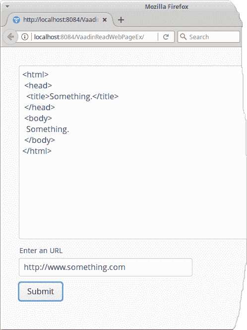

# Vaadin TextArea 教程

> 原文： [http://zetcode.com/vaadin/textarea/](http://zetcode.com/vaadin/textarea/)

在 Vaadin TextArea 教程中，我们学习 Vaadin `TextArea`组件的基础。 Vaadin TextArea 示例显示`TextArea`组件中网页的内容。 该示例使用 Jsoup 库读取网页内容。

## 瓦丹

Vaadin 是一种流行的 Java Web 开发框架，用于构建单页 Web 应用。

## Vaadin TextArea

`TextArea`是显示纯文本的多行文本区域组件。

## Vaadin TextArea 示例

以下程序演示了 Vaadin `TextArea`组件的用法。 它从网页中读取 HTML 内容，该内容在附近的`TextField`组件中指定。

```
<dependency>
    <groupId>org.jsoup</groupId>
    <artifactId>jsoup</artifactId>
    <version>1.9.2</version>
</dependency>

```

我们需要将`jsoup`依赖项添加到 Maven POM 文件中。 Jsoup 是一种流行的 Java HTML 解析器。

`MyUI.java`

```
package com.zetcode.main;

import javax.servlet.annotation.WebServlet;

import com.vaadin.annotations.Theme;
import com.vaadin.annotations.VaadinServletConfiguration;
import com.vaadin.server.VaadinRequest;
import com.vaadin.server.VaadinServlet;
import com.vaadin.ui.Button;
import com.vaadin.ui.TextArea;
import com.vaadin.ui.TextField;
import com.vaadin.ui.UI;
import com.vaadin.ui.VerticalLayout;
import com.zetcode.service.ReadPage;

@Theme("mytheme")
public class MyUI extends UI {

    @Override
    protected void init(VaadinRequest vaadinRequest) {

        VerticalLayout layout = new VerticalLayout();

        TextArea area = new TextArea();
        area.setWidth("650");
        area.setHeight("350");
        TextField field = new TextField("Enter an URL");
        field.setWidth("350");

        Button button = new Button("Submit");
        button.addClickListener(e -> {
            String content = ReadPage.read(field.getValue());
            area.setValue(content);
        });

        layout.addComponents(area, field, button);
        layout.setMargin(true);
        layout.setSpacing(true);

        setContent(layout);
    }

    @WebServlet(urlPatterns = "/*", name = "MyUIServlet", asyncSupported = true)
    @VaadinServletConfiguration(ui = MyUI.class, productionMode = false)
    public static class MyUIServlet extends VaadinServlet {
    }
}

```

在代码示例中，我们具有三个组件：`TextArea`，`TextField`和`Button`。

```
VerticalLayout layout = new VerticalLayout();

```

在我们的示例中，我们在`VerticalLayout`列中显示三个组件。

```
TextArea area = new TextArea();
area.setWidth("650");
area.setHeight("350");

```

创建了`TextArea`组件； 它的高度增加了。

```
TextField field = new TextField("Enter an URL");

```

创建了`TextField`组件； 在这里，我们提供要读取的网页的名称。

```
Button button = new Button("Submit");
button.addClickListener(e -> {
    String content = ReadPage.read(field.getValue());
    area.setValue(content);
});

```

在按钮事件处理程序中，我们使用`ReadPage.read()`方法读取网页，并使用`setValue()`方法将 HTML 数据设置为`TextArea`。

```
layout.addComponents(area, field, button);

```

使用`addComponents()`将这三个组件添加到垂直布局中。

`ReadPage.java`

```
package com.zetcode.service;

import java.io.IOException;
import java.util.logging.Level;
import java.util.logging.Logger;
import org.jsoup.Jsoup;

public class ReadPage {

    public static String read(String webPage) {

        String html = "";

        try {
            html = Jsoup.connect(webPage).get().html();
        } catch (IOException ex) {
            Logger.getLogger(ReadPage.class.getName()).log(
                    Level.WARNING, null, ex);
        }

        return html;
    }
}

```

`read()`方法使用 Jsoup 读取给定网页的内容。



Figure: Vaadin TextArea

在本教程中，我们展示了 Vaadin TextArea 组件的基础知识。 您可能也对相关教程感兴趣： [Jsoup 教程](/java/jsoup/)， [Vaadin ComboBox 教程](/vaadin/combobox/)， [Vaadin Grid 教程](/vaadin/grid/)， [Vaadin Button 教程](/vaadin/button/)， [Vaadin 滑块教程](/vaadin/slider/)， [Vaadin CheckBox 教程](/vaadin/checkbox/)， [Java 教程](/lang/java/)。