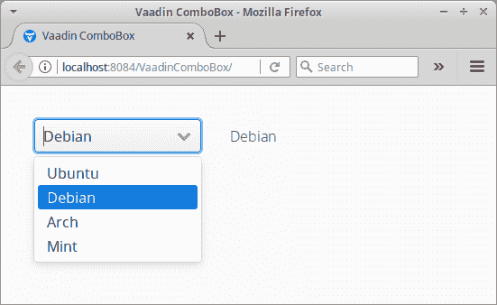

# Vaadin ComboBox 教程

> 原文： [http://zetcode.com/vaadin/combobox/](http://zetcode.com/vaadin/combobox/)

在 Vaadin ComboBox 教程中，我们学习 Vaadin ComboBox 组件的基础知识。 Vaadin ComboBox 示例在标签组件中显示选定的值。

## 瓦丹

Vaadin 是一种流行的 Java Web 开发框架，用于构建单页 Web 应用。

## Vaadin 组合框

`ComboBox`是允许从下拉列表中选择项目的选择组件。 在可编辑模式下，可以输入新值。

## Vaadin ComboBox 示例

以下程序演示了 Vaadin ComboBox 组件的用法。 从`ComboBox`中选择的值显示在标签组件中。

NetBeans IDE 可用于轻松创建 Vaadin Web 应用。 我们需要安装 NetBeans Vaadin 插件，然后创建一个新的 Vaadin Web 应用项目。

`MyUI.java`

```java
package com.zetcode.ui;

import javax.servlet.annotation.WebServlet;

import com.vaadin.annotations.Theme;
import com.vaadin.annotations.Title;
import com.vaadin.annotations.VaadinServletConfiguration;
import com.vaadin.data.HasValue;
import com.vaadin.server.VaadinRequest;
import com.vaadin.server.VaadinServlet;
import com.vaadin.ui.Alignment;
import com.vaadin.ui.ComboBox;
import com.vaadin.ui.HorizontalLayout;
import com.vaadin.ui.Label;
import com.vaadin.ui.UI;

@Theme("mytheme")
@Title("Vaadin ComboBox")
public class MyUI extends UI {

    @Override
    protected void init(VaadinRequest vaadinRequest) {

        HorizontalLayout layout = new HorizontalLayout();

        Label lbl = new Label();

        ComboBox<String> cb = new ComboBox<>();
        cb.setTextInputAllowed(false);
        cb.setItems("Ubuntu", "Debian", "Arch", "Mint");
        cb.setEmptySelectionAllowed(false);

        cb.addValueChangeListener((HasValue.ValueChangeEvent<String> event) -> {

            String item = event.getValue();
            lbl.setValue(item);
        });

        layout.addComponents(cb, lbl);
        layout.setComponentAlignment(lbl, Alignment.MIDDLE_CENTER);
        layout.setMargin(true);

        setContent(layout);
    }

    @WebServlet(urlPatterns = "/*", name = "MyUIServlet", asyncSupported = true)
    @VaadinServletConfiguration(ui = MyUI.class, productionMode = false)
    public static class MyUIServlet extends VaadinServlet {
    }
}

```

这是`MyUI`类。

```java
HorizontalLayout layout = new HorizontalLayout();

```

在我们的示例中，我们使用`HorizontalLayout`连续显示两个组件。

```java
Label lbl = new Label("");

```

`Label`组件不显示从组合框中选择的值。

```java
ComboBox<String> cb = new ComboBox<>();

```

创建一个`ComboBox`组件。

```java
cb.setTextInputAllowed(false);

```

使用`setTextInputAllowed()`方法，可以禁用`ComboBox`的可编辑模式。

```java
cb.setItems("Ubuntu", "Debian", "Arch", "Mint");

```

使用`setItems()`，我们将四个字符串元素添加到`ComboBox`中。

```java
cb.setEmptySelectionAllowed(false);

```

默认情况下，`ComboBox`显示一个空项目，允许用户不选择任何项目。 我们使用`setEmptySelectionAllowed()`禁用此选项。

```java
cb.addValueChangeListener((HasValue.ValueChangeEvent<String> event) -> {

    String item = event.getValue();
    lbl.setValue(item);
});

```

使用`addValueChangeListener()`，我们为`ComboBox`中的值更改添加了一个侦听器。 我们用`getValue()`方法获得`ComboBox`当前选择的项目。 使用`setValue()`方法将检索到的值设置为标签。

```java
layout.addComponents(cb, lbl);

```

通过`addComponents()`方法将这两个组件添加到`HorizontalLayout`。

```java
layout.setComponentAlignment(lbl, Alignment.MIDDLE_CENTER);

```

我们将标签放置在`setComponentAlignment()`和`Alignment.MIDDLE_CENTER`对齐的行中间。

```java
layout.setMargin(true);

```

我们在`HorizontalLayout`周围留了一些余量。

`mytheme.scss`

```java
@import "../valo/valo.scss";

@mixin mytheme {
  @include valo;

  .v-horizontal > .v-spacing {
    width: 2em;
  }
}

```

我们增加了`HorizontalLayout`中组件之间的间距。



Figure: Vaadin ComboBox

## Vaadin ComboBox 示例 II

在第二个示例中，`ComboBox`填充了从服务方法中检索到的城市对象的列表。 使用`setItemCaptionGenerator()`产生`ComboBox`中显示的字符串。

`City.java`

```java
package com.zetcode.bean;

import java.io.Serializable;

public class City implements Serializable {

    private static final long serialVersionUID = 1L;

    private Long id;
    private String name;
    private int population;

    public City() {
    }

    public City(Long id, String name, int population) {
        this.id = id;
        this.name = name;
        this.population = population;
    }

    public Long getId() {
        return id;
    }

    public void setId(Long id) {
        this.id = id;
    }

    public String getName() {
        return name;
    }

    public void setName(String name) {
        this.name = name;
    }

    public int getPopulation() {
        return population;
    }

    public void setPopulation(int population) {
        this.population = population;
    }

    @Override
    public String toString() {
        return "City{" + "id=" + id + ", name=" + name + 
                ", population=" + population + '}';
    }
}

```

这是`City` bean； 它包含`id`，`name`和`population`属性。

`ICityService.java`

```java
package com.zetcode.service;

import com.zetcode.bean.City;
import java.util.List;

public interface ICityService {

    public List<City> findAll();
}  

```

`ICityService`定义`findAll()`合约方法。

`CityService.java`

```java
package com.zetcode.service;

import com.zetcode.bean.City;
import java.util.ArrayList;
import java.util.List;

public class CityService implements ICityService {

    @Override
    public List<City> findAll() {

        List<City> cities = new ArrayList<>();

        cities.add(new City(1L, "Bratislava", 432000));
        cities.add(new City(2L, "Budapest", 1759000));
        cities.add(new City(3L, "Prague", 1280000));
        cities.add(new City(4L, "Warsaw", 1748000));
        cities.add(new City(5L, "Los Angeles", 3971000));
        cities.add(new City(6L, "New York", 8550000));
        cities.add(new City(7L, "Edinburgh", 464000));
        cities.add(new City(8L, "Berlin", 3671000));

        return cities;
    }
}

```

`CityService`返回`City`对象的列表。

`MyUI.java`

```java
package com.zetcode.ui;

import javax.servlet.annotation.WebServlet;

import com.vaadin.annotations.Theme;
import com.vaadin.annotations.Title;
import com.vaadin.annotations.VaadinServletConfiguration;
import com.vaadin.data.HasValue;
import com.vaadin.server.VaadinRequest;
import com.vaadin.server.VaadinServlet;
import com.vaadin.ui.Alignment;
import com.vaadin.ui.ComboBox;
import com.vaadin.ui.HorizontalLayout;
import com.vaadin.ui.Label;
import com.vaadin.ui.UI;
import com.zetcode.bean.City;
import com.zetcode.service.CityService;

@Theme("mytheme")
@Title("Vaadin ComboBox")
public class MyUI extends UI {

    @Override
    protected void init(VaadinRequest vaadinRequest) {

        CityService cityService = new CityService();

        HorizontalLayout layout = new HorizontalLayout();

        Label lbl = new Label();

        ComboBox<City> cb = new ComboBox<>();
        cb.setTextInputAllowed(false);
        cb.setItems(cityService.findAll());
        cb.setEmptySelectionAllowed(false);

        cb.setItemCaptionGenerator(City::getName);

        cb.addValueChangeListener((HasValue.ValueChangeEvent<City> event) -> {

            City city = event.getValue();
            String item = String.format("%s: %s", city.getName(), 
                    city.getPopulation());

            lbl.setValue(item);
        });

        layout.addComponents(cb, lbl);
        layout.setComponentAlignment(lbl, Alignment.MIDDLE_CENTER);
        layout.setMargin(true);

        setContent(layout);        
    }

    @WebServlet(urlPatterns = "/*", name = "MyUIServlet", asyncSupported = true)
    @VaadinServletConfiguration(ui = MyUI.class, productionMode = false)
    public static class MyUIServlet extends VaadinServlet {
    }
}

```

这是`MyUI`类。

```java
ComboBox<City> cb = new ComboBox<>();

```

创建参数化的`ComboBox`。

```java
cb.setItems(cityService.findAll());

```

`ComboBox`中填充了服务方法中的数据。

```java
cb.setItemCaptionGenerator(City::getName);

```

使用`setItemCaptionGenerator()`，我们选择要在`ComboBox`中显示为项目标签的城市名称。

```java
cb.addValueChangeListener((HasValue.ValueChangeEvent<City> event) -> {

    City city = event.getValue();
    String item = String.format("%s: %s", city.getName(), 
            city.getPopulation());

    lbl.setValue(item);
});

```

在标签中，我们显示城市名称及其人口，并用冒号分隔。

在本教程中，我们展示了 Vaadin ComboBox 组件的基础知识。 您可能也对相关教程感兴趣： [Vaadin 网格教程](/vaadin/grid/)， [Vaadin Button 教程](/vaadin/button/)， [Vaadin 滑块教程](/vaadin/slider/)， [Vaadin CheckBox 教程](/vaadin/checkbox/)， [Java 教程](/lang/java/)。