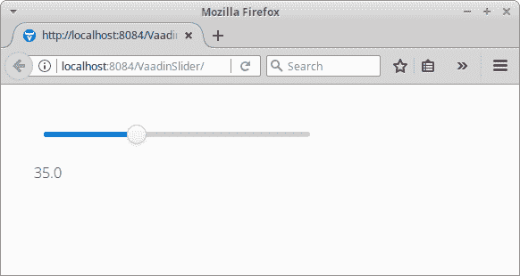

# Vaadin 滑块教程

> 原文： [http://zetcode.com/vaadin/slider/](http://zetcode.com/vaadin/slider/)

Vaadin Slider 教程显示了如何使用 Vaadin Slider 组件。 Vaadin 滑块示例在标签组件中显示选定的值。

## 瓦丹

Vaadin 是流行的 Java Web 开发框架。 Vaadin 用于构建单页 Web 应用。

## Vaadin 滑块

`Slider`是垂直或水平条，允许通过使用鼠标拖动条手柄在定义的范围内选择数值。 在拖动过程中，将显示该值。 `Slider`的默认方向为水平，默认范围为&lt; 0，100 &gt;。

## Vaadin 滑块示例

以下程序演示了 Vaadin 滑块组件的用法。 从`Slider`中选择的值显示在标签组件中。

NetBeans IDE 可用于轻松创建 Vaadin Web 应用。 我们需要安装 NetBeans Vaadin 插件，然后创建一个新的 Vaadin Web 应用项目。 我们将使用`MyUI.java`文件。

`MyUI.java`

```
package com.zetcode.vaadinslider;

import javax.servlet.annotation.WebServlet;

import com.vaadin.annotations.Theme;
import com.vaadin.annotations.Title;
import com.vaadin.annotations.VaadinServletConfiguration;
import com.vaadin.data.HasValue;
import com.vaadin.server.VaadinRequest;
import com.vaadin.server.VaadinServlet;
import com.vaadin.ui.Label;
import com.vaadin.ui.Slider;
import com.vaadin.ui.UI;
import com.vaadin.ui.VerticalLayout;

@Theme("mytheme")
@Title("Vaadin Slider")
public class MyUI extends UI {

    @Override
    protected void init(VaadinRequest vaadinRequest) {

        VerticalLayout verLayout = new VerticalLayout();

        Label lbl = new Label("");

        Slider slider = new Slider();
        slider.addValueChangeListener((HasValue.ValueChangeEvent<Double> event) -> {

            Double val = event.getValue();
            lbl.setValue(String.valueOf(val));
        });

        verLayout.addComponents(slider, lbl);
        verLayout.setSpacing(true);

        setContent(verLayout);
    }

    @WebServlet(urlPatterns = "/*", name = "MyUIServlet", asyncSupported = true)
    @VaadinServletConfiguration(ui = MyUI.class, productionMode = false)
    public static class MyUIServlet extends VaadinServlet {
    }
}

```

`MyUI`是应用入口点。 在这里，我们创建`Slider`组件。

```
Label lbl = new Label("");

```

这是`Label`组件，它不使用从滑块中选择的值。

```
Slider slider = new Slider();

```

在默认的水平方向上会创建一个`Slider`组件。

```
slider.addValueChangeListener((HasValue.ValueChangeEvent<Double> event) -> {

    Double val = event.getValue();
    lbl.setValue(String.valueOf(val));
});

```

使用`addValueChangeListener()`，我们为值更改添加了一个侦听器。 我们用`getValue()`方法获得`Slider`的当前值。 检索到的值通过`setValue()`方法设置为标签。

```
verLayout.addComponents(slider, lbl);
verLayout.setSpacing(true);

```

我们使用`addComponents()`方法将标签和滑块添加到布局管理器中。 组件之间的一些间距通过`setSpacing()`添加。

`mytheme.scss`

```
@import "../valo/valo.scss";

@mixin mytheme {
  @include valo;

  .v-slider { width: 20em }
}

```

我们增加`mytheme.scss`文件中`Slider`的宽度。



Figure: Vaadin Slider

在本教程中，我们展示了如何使用 Vaadin Slider 组件。 您可能也对相关教程感兴趣： [Vaadin ComboBox 教程](/vaadin/combobox/)， [Vaadin Button 教程](/vaadin/button/)， [Vaadin TextArea 教程](/vaadin/textarea/)， [Vaadin CheckBox 教程](/vaadin/checkbox/)， [Java 教程](/lang/java/)。