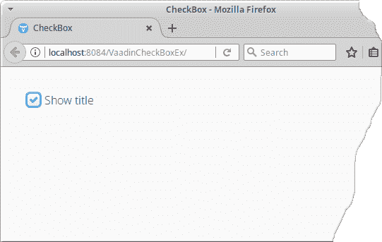

# Vaadin `CheckBox`教程

> 原文： [http://zetcode.com/vaadin/checkbox/](http://zetcode.com/vaadin/checkbox/)

Vaadin CheckBox 教程显示了如何使用 Vaadin CheckBox 组件。 Vaadin CheckBox 示例切换网页的标题。

## Vaadin

Vaadin 是流行的 Java Web 框架。 它用于构建单页 Web 应用。

## Vaadin `CheckBox`

`CheckBox`是可以选中或取消选中的选择组件。 单击复选框将更改其状态。 可以使用`setValue()`方法检查`CheckBox`。 `CheckBox`的值通过`getValue()`方法检索。 更改复选框的值将导致`ValueChangeEvent`，由`ValueChangeListener`处理。

## Vaadin `CheckBox`示例

以下程序演示了 Vaadin CheckBox 组件的用法。 复选框可切换网页标题。

Vaadin Web 应用可以在 NetBeans 中轻松创建。 我们需要安装 NetBeans Vaadin 插件，然后创建一个新的 Vaadin Web 应用项目。 我们将使用`MyUI.java`文件。

`MyUI.java`

```java
package com.zetcode.vaadincheckboxex;

import javax.servlet.annotation.WebServlet;

import com.vaadin.annotations.Theme;
import com.vaadin.annotations.VaadinServletConfiguration;
import com.vaadin.server.Page;
import com.vaadin.server.VaadinRequest;
import com.vaadin.server.VaadinServlet;
import com.vaadin.ui.CheckBox;
import com.vaadin.ui.UI;
import com.vaadin.ui.VerticalLayout;

@Theme("mytheme")
public class MyUI extends UI {

    @Override
    protected void init(VaadinRequest vaadinRequest) {

        VerticalLayout layout = new VerticalLayout();

        CheckBox cbox = new CheckBox("Show title");
        cbox.setValue(true);

        Page.getCurrent().setTitle("CheckBox");

        cbox.addValueChangeListener(e -> {

            Boolean val = e.getValue();

            if (val) {
                Page.getCurrent().setTitle("CheckBox");
            } else {
                Page.getCurrent().setTitle(".");
            }

        });

        layout.addComponents(cbox);
        layout.setMargin(true);

        setContent(layout);        
    }

    @WebServlet(urlPatterns = "/*", name = "MyUIServlet", asyncSupported = true)
    @VaadinServletConfiguration(ui = MyUI.class, productionMode = false)
    public static class MyUIServlet extends VaadinServlet {
    }
}

```

`MyUI`是应用入口点。 在这里，我们创建`CheckBox`组件。

```java
CheckBox cbox = new CheckBox("Show title");
cbox.setValue(true);

```

创建一个新的`CheckBox`。 构造函数的参数是`CheckBox`的标签。 由于默认情况下网页的标题是可见的，因此我们使用`setValue()`方法检查组件。

```java
Page.getCurrent().setTitle("CheckBox");

```

在这里，我们设置网页的标题。 我们也可以使用`@Title`注释设置页面标题。

```java
cbox.addValueChangeListener(e -> {

    Boolean val = e.getValue();

    if (val) {
        Page.getCurrent().setTitle("CheckBox");
    } else {
        Page.getCurrent().setTitle(".");
    }

});

```

使用`addValueChangeListener()`，我们为值更改添加了一个侦听器。 我们用`getValue()`方法获得`CheckBox`的当前值。 根据其状态，设置网页的标题。

```java
layout.addComponents(cbox);

```

通过`addComponents()`方法将`CheckBox`添加到布局中。

```java
layout.setMargin(true);

```

使用`setMargin()`方法，我们在`CheckBox`组件周围创建了一些边距。



Figure: Vaadin CheckBox

在本教程中，我们展示了如何使用 Vaadin CheckBox 组件。 您可能也对相关教程感兴趣： [Vaadin Button 教程](/vaadin/button/)， [Vaadin ComboBox 教程](/vaadin/combobox/)， [Vaadin TextArea 教程](/vaadin/textarea/)， [Vaadin 滑块教程](/vaadin/slider/)， [Java 教程](/lang/java/)。